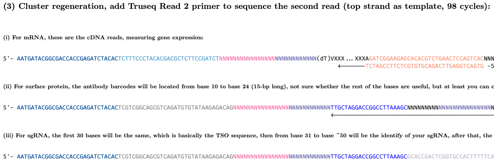

# Advanced Topics in scRNAseq 

What we'll cover:
    - Parallelization options for Seurat and other packages
    - Working with multimodal data
    - Controlling for Type I error in estimated clusters with clusterpval
    - Classifying cell types with a reference atlas with TransferAnchors from Seurat    
    - Pathway analysis (ORA, GSEA, iDEA)
    
## Parallelization options for Seurat and other packages

All of the methods we are discussing here involve computationally heavy methods, and as such also take advantage of parallelization where they can. Often in their documentation you will find how to use multiple cores when calling a function, usually involving a provided argument or involving a package called `future`. For example, Seurat has a [vignette on parallelization](https://satijalab.org/seurat/articles/future_vignette.html) with `future`. We will follow it here:

```{r}
library(future)
# check the current active plan
plan()
```

We set workers=8 because we've requested 8 cores. Additionally, we set `multisession` instead of `multiprocess` despite what the vignette says, because `multiprocess` is actually deprecated in `future` and we should be explicitly specifying `multisession` or `multicore` instead. Getting into the difference is out of scope of this workshop, but you can [read more](https://cran.r-project.org/web/packages/future/vignettes/future-1-overview.html) on future yourself if interested.

```{r}
# change the current plan to access parallelization
plan("multisession", workers = 4)
plan()
```
    
## Working with multimodal data

Multimodal scRNA-seq is a quickly evolving field that allows simultaneous measurements of multiple types of information from a given cell. We won't discuss these exhaustively, but will briefly cover CITE-seq, cell hashing, and the 10x ATAC + GEX Multiome kits.

**CITE-seq and Cell Hashing**
This workshop will touch on working with CITE-seq data, which simultaneously profiles cell surface protein and gene expression levels (https://www.nature.com/articles/nmeth.4380 and https://cite-seq.com/). 


Similar to the standard set-up for 10x gene expression preps, CITE-seq starts with a cell and a barcoded bead encapsulated in a droplet. However, before the encapsulation step, oligo-barcoded antibodies are added to the cells and will bind to the cell surface proteins. 
   


The oligo-tagged antibodies look like the above figure. Once the cells are in a droplet with a bead, the bead dissolves and the poly(dT) primer will allow amplification of both the poly-adenylated mRNA and the antibody barcode library. The two cDNA pools are size-separated before library prep continues, so you'll get back a quantitative gene expression and quantitative antibody derived tag (ADT) library. The authors of CITE-seq state: "We have successfully used ~125 antibodies and do not foresee any reason why this number can’t be further increased", but as always this is dependent on the quality of your antibodies.    

CellRanger/10X don't formally support CITE-seq for their own reasons and suggest you contact New York Genome Center/https://cite-seq.com/ or BioLegend for help (https://support.10xgenomics.com/single-cell-gene-expression/software/pipelines/latest/using/feature-bc-analysis#feature-ref).


Cell hashing is similar to CITE-seq, but the goal is to pool multiple samples per 10x run rather than to quantify cell surface proteins. It still uses oligo-tagged antibodies, but they target a smaller subset of cell surface proteins that are ubiquitously expressed and each sample has a unique oligo sequence that can be used to bin each cell back to the sample it originated from. A cell hashing experiment would result in an HTO library (HashTag Oligo) and a gene expression library.

{height=400px width=300px} 

BioLegend cells TotalSeq kits to run cell hashing experiments. TotalSeq-B and TotalSeq-C are supported by 10x and they use Capture Sequence 1 or the Template Switch Oligo as the capture sequence. Like CITE-seq, TotalSeq-A uses the Poly(dT) capture sequence and is not supported by 10x and they suggest you contact New York Genome Center/https://cite-seq.com/ or BioLegend for help.

**10X Multiome kit**

{height=175px width=500px} 

The 10x Multiome ATAC + GEX kits let you look at areas of open chromatin and gene expression at the same time. They use a similar approach to the others described above, where a gel bead has primers/capture sequences for gene expression libraries and ATAC-seq libraries. The general workflow starts with isolating single nuclei (rather than single cells). Then, single nuclei are treated with a transposase that fragments DNA in open chromatin areas and adds adapter sequences to the ends of the fragments. The gel beads contain the usual Poly(dT) to amplify poly-adenylated mRNA and also a 'Spacer' sequence that acts as a capture sequence for the ATAC-seq libraries that sequence areas of open chromatin. 

Let's go over the details of how the library prep works for 10x feature barcoding libaries:
- Some of these images are really wide and are getting cut off -- feel free to follow along here: https://teichlab.github.io/scg_lib_structs/methods_html/10xChromium3fb.html


The first step is sequence capture by the poly(dT) and Capture Sequence 1 or 2 and MMLV (Moloney Murine Leukemia Virus) reverse transcription.


Just like the previous discussion of the GE libraries, MMLV adds extra Cs


The template-switching oligo is added so we can continue across the other strand.


Adding the primers to amplify cDNA


At this point your different products will be different sizes so you can separate with size selection, unless its a CRISPR screen library --these need some extra PCR steps:


If you do have a CRISPR screen library, perform that extra PCR step.


Add the primers for library PCR to the products from step 5 (step 6 if CRISPR library).


Here's the final library structures for mRNA, surface protein libraries that use capture sequence 1, or CRISPR screen library.


For the sequencing, add the read 1 primers to sequence read 1 using the bottom strand as template sequences the cell barcode and UMI.


Sample index primer sequences the sample index from bottom strand (getting cut off for the surface protein and CRISPR libraries but all libraries do this step)


Cluster regeneration and add read 2 primer, sequences second read from the top strand (CRISPR library is getting cut off but you can view the source image at https://teichlab.github.io/scg_lib_structs/methods_html/10xChromium3fb.html).


###############################################

Let's try working with some multimodal data in Seurat.

As in the previous workshop, we'll need to set the `.libPaths()`, set a seed and `future.globals.maxSize`, and import the libraries.

```{r}
.libPaths(c('/usr/local/lib/R/site-library', '/usr/local/lib/R/library'))
set.seed(61)
options(future.globals.maxSize = 4000 * 1024^5)
library(RColorBrewer)
library(Seurat)
library(patchwork)
library(ggplot2)
library(dplyr)
library(hdf5r)
library(stringr)
library(biomaRt)
library(kableExtra)
library(knitr)
library(pdftools)
library(viridis)
library(openxlsx)
library(SeuratDisk)
library(SeuratData)
library(ComplexHeatmap)
library(plotly)
library(iDEA)
library(fgsea)
library(clusterpval)
library(msigdbr)

library('pbmc3k.SeuratData')
library('cbmc.SeuratData')
library('ifnb.SeuratData')
library('panc8.SeuratData')
data("pbmc3k")
data("cbmc")
data("ifnb")
data("panc8")

```

We'll work with the `cbmc` data for this section of the workshop, which is 8,617 cord blood mononuclear cells (CBMCs), produced with CITE-seq 
```{r}
cbmc
```

- This data has already come with the ADT assay added, which you'd have to add on your own if you were working with your own data.
- To do that, you'd use the `Read10x` or `Read10X_h5` functions to import your GE and ADT libraries. 
- At this point you might want to do some filtering on your data to get back cell barcodes where you've got both RNA and ADT data.
- That might look like this (I've commented out the code here since it won't actually run, you can see the Seurat vignette here https://satijalab.org/seurat/articles/hashing_vignette.html, which shows how to demultiplex cell hashing data):

First, read in the 10X data
```{r}
#pbmc.ge <- Read10X("/pbmc_ge/outs/filtered_feature_bc_matrix")
#pbmc.adt <- Read10X("/pbmc_adt/outs/filtered_feature_bc_matrix")
```

Then, find the column names (which are cells) where you have data from both assays
```{r}
#joint.bcs <- intersect(colnames(pbmc.ge), colnames(pbmc.adt))
```

Then subset counts by joint cell barcodes
```{r}
#pbmc.ge <- pbmc.ge[, joint.bcs]
#pbmc.adt <- pbmc.adt[, joint.bcs]
```

Then you'd use the `CreateSeuratObject` function with the gene expression matrix.
```{r}
#pbmc_seurat <- CreateSeuratObject(counts = pbmc.ge)
```

Then add the ADT data as an assay:
```{r}
#pbmc_seurat[["ADT"]] <- CreateAssayObject(counts = pbmc.adt)
```

Let's look at the multimodal seurat object assays:    

For the RNA assay, cells are columns and rows are genes.
```{r}
head(rownames(cbmc@assays$RNA))
head(colnames(cbmc@assays$RNA))
```

For ADT assay, cells are columns and the rows are cell surface proteins
```{r}
rownames(cbmc@assays$ADT)
head(colnames(cbmc@assays$ADT))
```

Make sure the RNA is the default assay:
```{r}
DefaultAssay(cbmc) <- 'RNA'
```

We can run through the standard data normalization, clustering, and dimension reduction pipeline, skipping the QC filtering since this is a curated dataset.
```{r}
# perform visualization and clustering steps
cbmc <- SCTransform(cbmc,verbose=FALSE,return.only.var.genes = FALSE)
cbmc <- RunPCA(cbmc, verbose = FALSE)
cbmc <- FindNeighbors(cbmc, dims = 1:10)
cbmc <- FindClusters(cbmc)
cbmc <- RunUMAP(cbmc, dims = 1:10)
cbmc <- RunTSNE(cbmc, tsne.method = "FIt-SNE", seed.use=61)
DimPlot(cbmc, label = TRUE)
```

We'll also normalize the CITE-seq ADT data. We'll use a CLR or centered log ratio transformation (https://www.ncbi.nlm.nih.gov/pmc/articles/PMC5669064/). The `margin` argument indicates if you are normalizing across `features` (margin = 1) or `cells` (margin = 2). The authors of Seurat recommend normalizing across cells in most cases unless there's a big difference in the ADT counts across cells, but note that gene-based normalization can fail if there's differences in sequencing depth or cell size. (https://github.com/satijalab/seurat/issues/2954, https://github.com/satijalab/seurat/issues/871). 

```{r}
DefaultAssay(cbmc) <- "ADT"
cbmc <- NormalizeData(cbmc, normalization.method = "CLR", margin = 2)
```

Then we can visualize our data -- let's look at the CD19 RNA and Protein expression:
```{r}
DefaultAssay(cbmc) <- "RNA"
p1 <- FeaturePlot(cbmc, 
            features = "CD19", 
            reduction = 'umap',  
            order = T) &
    theme(legend.position = "right") &
    scale_colour_gradient(low = '#67a9cf', high = '#ef8a62') &
    labs(title = "RNA - CD19")

DefaultAssay(cbmc) <- "ADT"
p2 <- FeaturePlot(cbmc, 
            features = "CD19", 
            reduction = 'umap',  
            order = T) &
    theme(legend.position = "right") &
    scale_colour_gradient(low = '#67a9cf', high = '#ef8a62') &
    labs(title = "ADT - CD19")


p1 | p2
```

We can leverage the multimodal data to find protein and RNA markers

First, which clusters of cells are expressing CD19 on their cell surfaces?
```{r}
VlnPlot(cbmc, "CD19", assay = "ADT")
```

Let's look at the ADT markers for cluster 10. You can use the same `FindMarkers` functions that are used for RNA markers.
```{r}
adt_markers <- FindMarkers(cbmc, ident.1 = 10, assay = "ADT")
rna_markers <- FindMarkers(cbmc, ident.1 = 10, assay = "RNA")
```

```{r}
head(rna_markers)
head(adt_markers)
```
We see that there are some cell types that express CD19 on their cell surfaces and that information is also reflected in the RNA data, where there's a higher expression of the CD19 gene.


Let's clear the `cbmc` data before we move on.

```{r}
rm(cbmc)
```


## Controlling for Type I error in estimated clusters with clusterpval

The first part of this workshop ran through how to use Seurat to cluster the cells. The first step is running a PCA (`RunPCA`), which then gets used as the input for the `FindNeighbors` function. `FindNeighbors` constructs a KNN graph based on the euclidean distance in PCA space and refines the edge weights between any two cells based on the shared overlap in their local neighborhoods (Jaccard similarity). The next step is `FindClusters`, where we apply the Louvain algorithm to iteratively group cells together, with the goal of optimizing the standard modularity function. 

After we have grouped the cells, we might want to ask questions about the clusters -- for example, are there differentially expressed genes across clusters? **This gets us into 'double-dipping' territory.** We have clustered the cells based on their gene expression and then want to ask questions about which genes are differentially expressed across those groups. We are generating hypotheses based on the data and then testing the hypotheses on the same data. This can lead to an uncontrolled type I error rate when using classical hypothesis tests like the Wilcoxon test. 

We can use a program called `clusterpval` to check whether the difference in means of the clusters is significant. [@Gao2021] This is meant to partially address the problem of "double dipping," where the same data used to cluster and thus form groups is then used again for post-clustering analysis with the clusters designated as the groups. The method adjusts the pvalue for difference in means of the clusters. However it does not adjust pvalues for differential expression analysis, or difference in means of a subset of the data (i.e. genes), which would be what we actually want to do. Nevertheless it can be used as a check on the validity of the clusters.

We largely follow the code from [issue#2](https://github.com/lucylgao/clusterpval/issues/2) on the `clusterpval` repo. They are working on an [implementation for expression analysis](https://github.com/lucylgao/clusterpval/issues/3), so what this will tell you now is mostly whether your clusters are significant or not. My implementation of the clustering function doesn't start from the counts matrix, it starts from the integrated data and just runs `FindClusters` with a different random seed each time, so that may impact results as well. This is to speed up computation.

We can try working though running clusterpval. First, we will filter the pbmc3k data to keep it very small and then quickly run through normalization, clustering, and dimension reduction.


```{r}
pbmc3k
pbmc3k_sub <- subset(pbmc3k, subset = nFeature_RNA > 1000 & nFeature_RNA < 7000 )
pbmc3k_sub <- SCTransform(pbmc3k_sub,verbose=FALSE,return.only.var.genes = FALSE)
pbmc3k_sub <- RunPCA(pbmc3k_sub)
pbmc3k_sub <- FindNeighbors(pbmc3k_sub, dims = 1:8)
pbmc3k_sub <- FindClusters(pbmc3k_sub)
pbmc3k_sub <- RunUMAP(pbmc3k_sub, dims = 1:8)
pbmc3k_sub <- RunTSNE(pbmc3k_sub, tsne.method = "FIt-SNE", seed.use=61)
DimPlot(pbmc3k_sub, label = TRUE)

```

Let's try running clusterpval. First, assign the clusters to `cluster` and change the default assay (use `integrated` if you have integrated data). We also make a function called `function_cluster` that will use a random seed to generate a new set of clustering for our Seurat object each time its run. We use this function as an argument to the `test_clusters_approx` function from clusterpval, which approximates p-values for the clusters via importance sampling. We'll run it with 1000 draws for the sake of time. Arguments to `test_clusters_approx` are the counts matrix, `k1` and `k2` the cluster IDs we want to test for (here we are testing cluster 3 vs cluster 1), the original clustering results, and a function to rerun clustering on our data.

`clusterpval` is parallelized using `future_lapply` in the same way that several of the Seurat functions are parallelized using `future`, so the `multisession` plans we set above will apply here as well.

```{r}
clusters <-pbmc3k_sub@meta.data[["seurat_clusters"]]
DefaultAssay(pbmc3k_sub) <- "SCT"
set.seed(581762)
function_cluster <- function(x) {
    seed = sample.int(999999, size=1)
    tmp <- FindClusters(pbmc3k_sub, random.seed=seed)
    return(tmp@meta.data[["seurat_clusters"]])
}
tc <- test_clusters_approx(as.matrix(pbmc3k_sub@assays[["RNA"]]@counts),
                     k1=3, k2=1, cl=clusters, cl_fun=function_cluster, ndraws=1000)
```

```{r}
tc
```
The resulting output contains:
stat: the test statistic - the Euclidean distance between the mean of cluster k1 and the mean of cluster k2
pval: the approximate p-value
stderr: standard error of the p-value estimate
clusters: the estimated cluster assignments

We are getting back NaN for the pvalues, likely because we are using only 1000 draws because we have limited time/oscar resources for the workshop.
The authors are working on an implementation for expression analysis what would allow this method to perform differential expression p-value correction, but it is not functional as yet (https://github.com/lucylgao/clusterpval/issues/3).

##############################

## Working with TransferAnchors from Seurat 

Seurat has a few built in methods to identify shared cell states present across different datasets. They can be different conditions, different individuals, technologies, etc. First, Seurat tries to find anchors between pairs of datasets. These represent pairwise correspondences between individual cells (one in each dataset), that Seurat hypothesizes originate from the same biological state. These ‘anchors’ are then used to harmonize the datasets, or transfer information from one dataset to another. In the first part of this workshop, we went over running data integration with SCTransform-normalized datasets from different experiments. In this follow up session, we will go over how you can leverage an integrated reference dataset to annotate new query datasets. This can be helpful for using cell atlases to annotate cell types in your experimental datasets.

We'll work with the `panc8` data.

```{r}
panc8
?panc8
```
First, lets split the object and run SCTransform

```{r}
pancreas.list <- SplitObject(panc8, split.by = "tech")
```

Then we run SCTransform
```{r}
pancreas.list <- lapply(pancreas.list, function(x) {
    x <- SCTransform(x,verbose=FALSE,return.only.var.genes = FALSE)}) 
```

To construct a reference, we will identify ‘anchors’ between the individual datasets. We'll pick three of the objects to construct our integrated reference and save one for using as a query later.  
```{r}
pancreas.ref <- c(pancreas.list$celseq, pancreas.list$celseq2, pancreas.list$smartseq2)
pancreas.query <- pancreas.list$fluidigmc1
```

Then we can `SelectIntegrationFeatures`, `PrepSCTIntegration`, `FindIntegrationAnchors`, and `IntegrateData`, Run PCA and UMAP
```{r}
integration_features <- SelectIntegrationFeatures(pancreas.ref)
pancreas.ref <- PrepSCTIntegration(object.list = pancreas.ref, anchor.features = integration_features)
ref.anchors <- FindIntegrationAnchors(object.list = pancreas.ref , normalization.method = "SCT", anchor.features = integration_features)
pancreas.ref <- IntegrateData(anchorset = ref.anchors, normalization.method = "SCT")

pancreas.ref <- RunPCA(pancreas.ref, verbose = FALSE)
pancreas.ref <- RunUMAP(pancreas.ref, reduction = "pca", dims = 1:20, verbose = FALSE)

p1 <- DimPlot(pancreas.ref, reduction = "umap", split.by = "tech") & coord_fixed(ratio = 1)
p2 <- DimPlot(pancreas.ref, reduction = "umap", group.by = "celltype", label = TRUE, repel = TRUE) +
    NoLegend() & coord_fixed(ratio = 1)
p1 / p2
```


Seurat supports the projection of reference data onto a query object. While many of the methods are conserved (both procedures begin by identifying anchors), there are two important distinctions between data transfer and integration:

    In data transfer, Seurat does not correct or modify the query expression data.
    In data transfer, Seurat has an option (set by default) to project the PCA structure of a reference onto the query, instead of learning a joint structure with CCA. We generally suggest using this option when projecting data between scRNA-seq datasets.

After finding anchors, we use the `TransferData()` function to classify the query cells based on reference data (a vector of reference cell type labels). `TransferData()` returns a matrix with predicted IDs and prediction scores, which we can add to the query metadata.

First, FindTransferAnchors between pancreas.ref and pancreas.query.
```{r}
pancreas.anchors <- FindTransferAnchors(reference = pancreas.ref, 
                                        query = pancreas.query,
                                        dims = 1:20, 
                                        reference.reduction = "pca")
```

Classify query cells based on reference data
```{r}
predictions <- TransferData(anchorset = pancreas.anchors, 
                            refdata = pancreas.ref$celltype,
                            dims = 1:20)
```

Add the cell predictions to the pancreas.query metadata
```{r}
pancreas.query <- AddMetaData(pancreas.query, metadata = predictions)
```

Because we have the original label annotations from our full integrated analysis, we can evaluate how well our predicted cell type annotations match the full reference. In this example, we find that there is a high agreement in cell type classification, with over 96% of cells being labeled correctly.
```{r}
pancreas.query$prediction.match <- pancreas.query$predicted.id == pancreas.query$celltype
table(pancreas.query$prediction.match)
```

Lets clean up a little before we continue:
```{r}
rm(panc8)
rm(pancreas.list)
rm(pancreas.ref)
rm(pancreas.query)
```

##############################

## Pathway / gene set analysis

Pathway analysis, sometimes known as gene set analysis, attempts to identify genes that are over-represented in a set of genes that make up pathways associated with various mechanisms. You can think of it like this: if a particular pathway consists of 300 genes, and 280 of those 300 genes are in our list of differentially expressed genes, then is that pathway relevant to the differences between our groups of interest?

Two commonly used methods to look for enrichment are overrepresentation analysis (ORA) or gene set enrichment analysis (GSEA).

- Over Representation Analysis (ORA) looks for functions or processes that are over-represented (= enriched) in an experimentally-derived gene list (e.g. all differentially expressed genes) relative to a background gene list (e.g. all genes in the dataset). 
- Gene Set Enrichment (GSEA) takes a ranked list of genes (e.g. all genes in the differential expression analysis sorted by log fold change or test statistic or some other metric) and calculates an enrichment score based on whether a gene set is over-represented at the top or bottom of the list.

ORA will miss smaller but coordinated changes in pathways -- so, when a pathway doesn't contain many differentially expressed genes, but all the genes in the pathway change together. GSEA is designed to catch these - however how to rank genes is an open question with variable results.

A third method specifically designed for single-cell is integrated differential expression and gene set enrichment analysis (iDEA) [@Ma2020], which we will go into further below. Here we'll talk about these three methods as applied to single cell data.

### Preparing data

All pathways analysis methods start with a list of gene markers. GSEA and iDEA also require summary statistics associated with the gene markers. As such we will compute markers first, on the `ifnb` data. Let's run through the standard data processing pipeline and run `FindMarkers` to compare `STIM` to `CTRL`.

```{r}
ifnb
ifnb_sub <- subset(ifnb, subset = nFeature_RNA > 1000 & nFeature_RNA < 7000 )
ifnb.list <- SplitObject(ifnb_sub, split.by = 'stim')
ifnb.list <- lapply(ifnb.list, function(x) {
    x <- SCTransform(x,verbose=FALSE,return.only.var.genes = FALSE)})
ifnb.merge <- merge(x = ifnb.list$CTRL, y = ifnb.list$STIM, merge.data = TRUE) 
integration_features <- SelectIntegrationFeatures(ifnb.list)
VariableFeatures(ifnb.merge) <- integration_features
ifnb.merge <- RunPCA(ifnb.merge)
ElbowPlot(ifnb.merge)
```

```{r}
ifnb.list <- PrepSCTIntegration(object.list = ifnb.list, anchor.features = integration_features)
ifnb.anchors <- FindIntegrationAnchors(object.list = ifnb.list, normalization.method = "SCT", anchor.features = integration_features)
ifnb_integrated <- IntegrateData(anchorset = ifnb.anchors, normalization.method = "SCT")
ifnb_integrated <- RunPCA(ifnb_integrated)
ifnb_integrated<- FindNeighbors(ifnb_integrated, dims = 1:10)
ifnb_integrated <- FindClusters(ifnb_integrated)
ifnb_integrated <- RunUMAP(ifnb_integrated, dims = 1:10)
ifnb_integrated <- RunTSNE(ifnb_integrated, tsne.method = "FIt-SNE", seed.use=61)
```

When you run differential expression for this type of analysis, make sure you modify the default settings for `FindMarkers`, otherwise it will do some filtering of your data and so will report back a smaller subset of genes. Additionally, make sure the assay you run `FindMarkers` on is the `RNA` assay rather than `SCT` or `Integrated`. Here we also use the option `test.use="MAST"` to use MAST [@Finak2015], a method developed specifically for differential expression analysis in single-cell data.

```{r}
DefaultAssay(ifnb_integrated) <- 'RNA'
Idents(ifnb_integrated) <- 'stim'
#run DE testing with modified settings -- by default FindMarkers will filter out genes that are lowly expressed, etc. and we don't want that -- we want all the stats.
ctl_vs_stim <- FindMarkers(ifnb_integrated, ident.1 = 'CTRL', ident.2 = 'STIM', test.use="MAST", min.cells.group = 1, min.cells.feature = 1, min.pct = 0, logfc.threshold = 0, only.pos = FALSE)
```

The other input that all of these analyses require is a list of gene sets or pathways of interest. We will use the msigdbr R package. It provides Molecular Signatures Database (MSigDB) gene sets typically used with the Gene Set Enrichment Analysis (GSEA) software (see https://www.gsea-msigdb.org/gsea/msigdb/). The gene sets are divided into collections:

H 	hallmark gene sets  are coherently expressed signatures derived by aggregating many MSigDB gene sets to represent well-defined biological states or processes.
C1 	positional gene sets  for each human chromosome and cytogenetic band.
C2 	curated gene sets  from online pathway databases, publications in PubMed, and knowledge of domain experts.
C3 	regulatory target gene sets  based on gene target predictions for microRNA seed sequences and predicted transcription factor binding sites.
C4 	computational gene sets  defined by mining large collections of cancer-oriented microarray data.
C5 	ontology gene sets  consist of genes annotated by the same ontology term.
C6 	oncogenic signature gene sets  defined directly from microarray gene expression data from cancer gene perturbations.
C7 	immunologic signature gene sets  represent cell states and perturbations within the immune system.
C8 	cell type signature gene sets  curated from cluster markers identified in single-cell sequencing studies of human tissue.

First, let's see what gene sets are available for human: 

```{r}
all_gene_sets <- msigdbr(species = "Homo sapiens")
all_gene_sets 
```

I know already that I want to look for genes enriched in this category: https://www.gsea-msigdb.org/gsea/msigdb/cards/REACTOME_INTERFERON_SIGNALING, we know the category and subcategory, so lets filter to just get those sets:

```{r}
all_gene_msig <- msigdbr(species = "Homo sapiens",category = "C2", subcategory = "CP:REACTOME")
```

For the sake of getting things to run in a reasonable time for this workshop, let's narrow things down a little more and just pick a few gene modules. We can see what options are available:

```{r}
unique(all_gene_msig$gs_description)

filtered_genes <- all_gene_msig %>% dplyr::filter(gs_description == 'Interferon Signaling' | gs_description == 'Glycolysis' | gs_description == 'Fatty acid metabolism' | gs_description=="Polymerase switching") %>% dplyr::distinct(gs_name, gene_symbol)
```

How these gene sets should be formatted varies for each type of package, so we will leave the details for that later.

### Overrepresentation analysis

Overrepresentation analysis (ORA) actually has quite a simple formula to compute the p-value for a given gene set. If N is the total number of genes in the background distribution (the list of all genes across all the gene sets), M the number of genes within the gene set that are in the background, n the size of the list of DE gnes, and k the number of DE genes that are in the gene set, then the p-value can be computed with the hypergeometric distribution

$$ p = 1 - \sum_{i=0}^{k-1} \frac{\binom{M}{i} \binom{N-M}{n-i}}{\binom{N}{n}} $$
p-values should then be adjusted for multiple comparison.

We will use the package `clusterProfiler` to do this computation as well as adjust. Since in ORA we only want the list of DE genes, we filter out `ctl_vs_stim` to only keep genes with pvalue < 0.05. With this list and the `filtered_genes` dataframe from `misgdbr` we have enough inputs for the `clusterProfiler::enricher` function to do our analysis.

```{r}
library(clusterProfiler)
de_genes <- filter(ctl_vs_stim, p_val_adj < 0.05) %>% rownames()
ora <- enricher(gene=de_genes, pvalueCutoff = 0.05, pAdjustMethod="BH",
         TERM2GENE=filtered_genes)
ora@result
```

As we can see, the interferon signaling pathway has a significant pvalue, but the other 3 pathways do not. The results also include a GeneRatio and a BgRatio, corresponding to M/N and k/n respectively. This is in line with our expectations. Although ORA is rather simple, it's a good first step to check your expectations quickly before moving on to more complicated analyses.

### Gene set enrichment analysis (GSEA)

GSEA is a more in-depth method that can 

    Enrichment score (ES) - a representation of how overrepresented a gene set is at the top or bottom of the ranked list.
    p-value of ES - the significance of the score for that gene set
    Adjusted p-value - an adjusted p-value to account for multiple hypothesis testing of multiple gene sets

- Gene Set Enrichment (GSEA) takes a ranked list of genes (e.g. all genes in the differential expression analysis sorted by log fold change or test statistic or some other metric) and calculates an enrichment score based on whether a gene set is over-represented at the top or bottom of the list.

ORA will miss smaller but coordinated changes in pathways -- so, when a pathway doesn't contain many differentially expressed genes, but all the genes in the pathway change together.


We also run a more standard GSEA analysis, on just the Hallmark gene sets. There is an open question of how to create a ranked list for this analysis. We started with avg_logFC as was suggested in issue#50 on the fgsea repo, but it returned no significant pathways at all, which does not seem right for our comparisons also given Table \@ref(tab:de-markers). This may be because in the discussion avg_logFC was suggested when comparing markers just between cell type clusters, but we are also actually comparing between different treatment types. Another option was to use -sign(avg_log2FC)*log10(p_val_adj), which incorporates both logfoldchange and the pvalue. This approach seemed more reasonable and yielded results more similar to iDEA.
iDEA

GSEA and ORA are dependent on an initial differential expression analysis. However, the differential expression of an individual gene also has an obvious dependence on gene set enrichment, as gene sets contain information about the individual genes within the set. iDEA (integrative Differental expression and gene set Enrichment Analysis) addresses this joint dependence through a model that jointly estimates both differential expression and gene set enrichment. The input to this method is still a list of per-gene summary statistics from an initial differential expression analysis, but iDEA has increased power and provides updated results for detection of both differentially expressed genes and gene sets.
notes for brainstorming

    Show how to make ranked list with log2FC and -sign(log2FC)xlog10(pval) for GSEA with fgsea and compare


### iDEA

iDEA (https://xzhoulab.github.io/iDEA/) is a more recent method which performs joint estimation of differential expression and gene set enrichment. It assumes you have already run differential expression analysis and expects an input of gene-level summary stats -- the fold changes and their variances. Here we can calculate that information from our Seurat output:

```{r}
ctl_vs_stim$zscore <- qnorm(ctl_vs_stim$p_val/2.0, lower.tail=FALSE) #### convert the pvalue to z-score
ctl_vs_stim$beta <- ctl_vs_stim$avg_log2FC
ctl_vs_stim$se_beta <- abs(ctl_vs_stim$beta/ctl_vs_stim$zscore)
ctl_vs_stim$beta_var <- ctl_vs_stim$se_beta^2
summary <- data.frame(beta = ctl_vs_stim$beta, beta_var = ctl_vs_stim$beta_var)
rownames(summary) <- rownames(ctl_vs_stim)
summary$gene_symbol <- rownames(summary) 
```

For the input to our GSEA program we need a matrix of data where the rows are genes, the columns are pathways or modules of genes, and the dataframe is filled with 1 and 0 for presence/absence. Let's do some wrangling to get things in the right format.

```{r}

#set all to 1
filtered_genes$value <- 1
```

```{r}
#pivot wider and fill in empy rows with 0
annots <- as.data.frame(tidyr::pivot_wider(filtered_genes, id_cols=gene_symbol,names_from=gs_name, values_from=value, values_fill=0)) 
```

Filter so that the rownames of annots and summary stats match exactly because this is what iDEA expects. 
```{r}
joint.genes <- intersect(summary[,3], annots[,1])
sum_stats_sub <- summary %>% filter(gene_symbol %in% joint.genes)
annots_sub <- annots %>% filter(gene_symbol %in% joint.genes)

rownames(sum_stats_sub) <- sum_stats_sub$gene_symbol 
sum_stats_sub$gene_symbol <- NULL

rownames(annots_sub) <- annots_sub$gene_symbol
annots_sub$gene_symbol <- NULL
```


```{r}
idea <- CreateiDEAObject(as.data.frame(sum_stats_sub), as.data.frame(annots_sub))
```


#bump mcmc_iter to 100 to help things go faster
```{r}
idea <- iDEA.fit(idea,
	         mcmc_iter=100, 
	         verbose=TRUE)
```
Add corrected pvalues
```{r}
idea <- iDEA.louis(idea)
```

Look at the results for the gene sets
```{r}
idea@gsea
```
The sign in `annot_coef` tells you whether this pathway has DE genes in it, regardless of the strength of the up or down regulation. 

```{r}
pip <- unlist(idea@de[["REACTOME_INTERFERON_SIGNALING"]]$pip)

### posterior inclusion probability of a gene being DE gene.
pip = unlist(idea@de[["GO_REGULATION_OF_CANONICAL_WNT_SIGNALING_PATHWAY"]]$pip)
### head the posterior inclusion probability for each gene
head(pip)
idea@de$REACTOME_INTERFERON_SIGNALING$beta idea@de$REACTOME_INTERFERON_SIGNALING$pip
```

