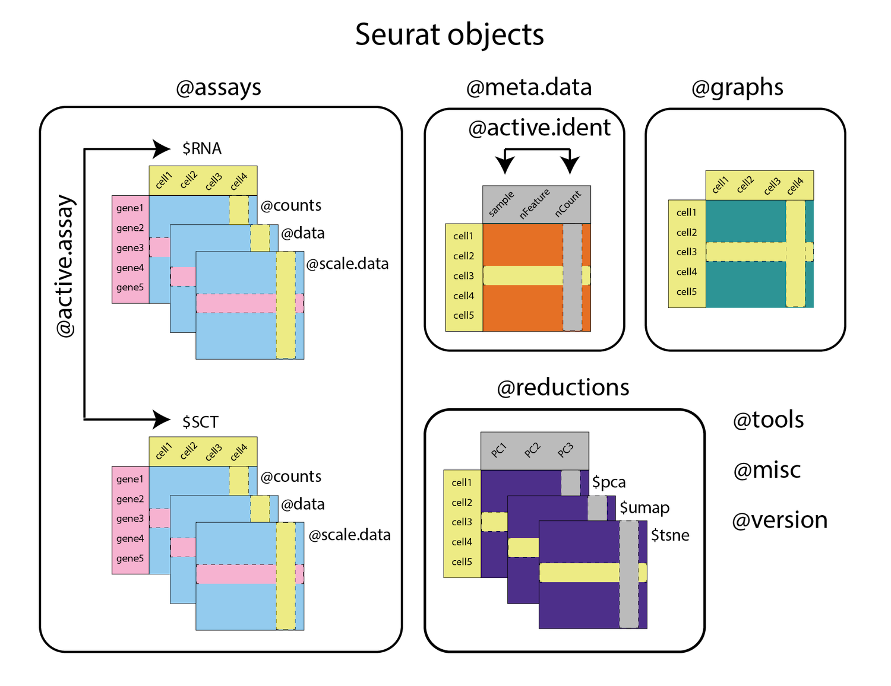

1. Go to ood.ccv.brown.edu (you will need an Oscar account).
2. Look under 'Expert GUIs', you'll see a card called 'RStudio on Singularity', click it.

Fill in the fields as follows:

`Account`: leave blank     
`Partition`: leave blank       
`Number of hours`: 2      
`Num Cores`: 16       
`Memory`: 30      
`Singularity Container Path`: /gpfs/data/shared/databases/workshops/dscov/scrna_r_workshop/metadata/dscov_sct.sif      
`Package install Path`: leave blank      
`Path for R Executable`: ~     
`R Module`: leave blank     
`Additional Data Path`: /gpfs/data/shared/databases/workshops/dscov/scrna_r_workshop     

Once your job starts, click the button to connect to session.     
At the top of the screen you'll see a menu bar that starts with 'file', click on 'file' and 'open file'.     
It will ask for a File name -- paste this into the box:      `/gpfs/data/shared/databases/workshops/dscov/scrna_r_workshop/fall2022-dscov-scrna.Rmd`      

# Introduction to scRNA-seq

**What we will cover**
- Bulk vs single cell RNAseq     
- Working with Seurat objects     
- Data QC and filtering      
- Merging and integrating data       
- SCTransform normalization      
- Seurat log normalization        
      
Much of this notebook is adapted from the Seurat vignettes https://satijalab.org/seurat and GitHub repository https://github.com/satijalab/seurat

### What is RNAseq?
The central dogma of biology refers to the concept that in general, biological information flows from DNA to RNA to protein. Proteins are the functional molecules that actually help a living organism maintain homeostasis and self-regulate (like enzymes to break down food, etc.). This process is dynamic and is regulated at different stages. For this workshop, we are going to talk about analyzing RNAseq or transcriptome data, which refers to the step where DNA turns into RNA. 

The general experimental process involves setting up your experimental conditions, extracting RNA from your different experimental conditions, performing the library preparation steps (e.g., cDNA synthesis, fragmentation, and adding adapters). These libraries are sequenced on an Illumina FlowCell. What ends up getting sequenced is sort of like puzzle pieces -- short fragments of RNA.

The output from this process is these raw reads (.fastq or .fq files), which are the text files consisting of short sequences of nucleotides that correspond to those fragments of RNA. To figure out what genes the fragments came from, you align the a reference genome. The more reads that end up aligning back to a gene, the more highly expressed that gene. This data can be processed to get back a counts matrix telling you how many fragments came from each gene. You can use it to look at differential expression (which genes are changing in some experimental condition) and perform other downstream analyses.

```{r}

```

### How does scRNAseq differ from bulk RNAseq?

- In bulk RNA-seq you are taking a snapshot of expression of all the cells in a sample and your measurements are aggregated across all of those cells.

- In scRNA-seq, you can get a sense of the heterogeneity of the cells in your sample.
    - Are there novel or rare cell types?
    - What about cell type specific gene expression?
    - Does the distribution of different cell types change across time or treatment?
- This increased resolution comes with some unique challenges.
    - Dropouts - genes that are not detected in some cells, can lead to sparse expression matrices with many zero values.
    - Doublets - sequencing two cells at the same time and can't distinguish their expression or cell types, need to filter these out during QC.
    - Dying cells - you will lose some cells because they are dead or dying, you can also filter these out during sample QC.
    - You also should be cautious when thinking about your sample sizes. For example, you may be sequencing thousands of cells but if they all come from the same mouse you lose the ability to generalize your findings.
    
```{r}

```

   
### scRNA-seq technologies
- Although 10X genomics is probably the most popular technology for scRNA-seq, there are other flavors (see PMID 30472192 and PMID 28212749).   

    
```{r}
knitr::include_graphics('src/10x_flow.png')
```
        
- 10x sequencing encapsulates a cell, reagents, and a bead w/ primer in an oil droplet (aka GEM or Gel Bead-in EMulsion).    
- If you have a situation where one droplet has two cells, this is a 'doublet', you can also have empty droplets where there's no cell encapsulated.

```{r}
knitr::include_graphics('src/10x_bead.png')
```
        
- After encapsulation of cells, beads, and reagents in the oil droplets, the bead is dissolved and releases primers. 
- The poly (dT) primers are used for generating the gene expression libraries. 
- The 'barcode' is a cell barcode.
- The 'UMI' is a unique molecular identifier for each RNA molecule.
- The capture sequence primers are shown in a lighter shading because they are only used in situations where you'd like to add an extra channel of information to your experiment by using feature barcoding (cell-surface protein characterization, multiplexing, etc.).     
      
```{r}
knitr::include_graphics('src/single_vs_double.png')
```

- 10x gene expression libraries will look like either one of these images -- single or dual indexed.
- Dual indexed libraries are beneficial to help prevent index hopping (https://www.10xgenomics.com/blog/sequence-with-confidence-understand-index-hopping-and-how-to-resolve-it).
- https://teichlab.github.io/scg_lib_structs/ is an excellent resource for information about the resulting library structures for 10x libraries (and other single cell technologies like Drop-seq or SMART-seq).

### Seurat objects
- This workshop focuses on using Seurat objects to structure your scRNA-seq data (https://github.com/satijalab/seurat/wiki/Seurat).     
```{r}

```

- Each Seurat object is composed of different slots.
    - **`assays`** is a list of all the assays in the object.
        - Typically only has the `RNA` assay, but you can add others (like `SCT` shown in the figure above, could also be antibody-derived tags, etc.). 
        - You can see which assay is the currently active assay by looking in the `active.assay` slot and switch between them using the `DefaultAssay()` function.
        - Each assay will store multiple transformations of the data in different slots -- in the case of `RNA` data these slots are: 
            - `@counts` contains the raw counts.
            - `@data` contains the normalized counts.
            - `@scale.data` contains the scaled data for dimensional reduction.
        - The slots store the data as a sparse matrix where the rows are gene and the columns are cells.      
    - **`meta.data`** is a matrix of all the cell-level metadata.
        - This will include information about which condition, timepoint, batch, etc. a for a given cell.
        - It also includes metrics that will be relevant for QC, like `nCount_RNA` and `nFeature_RNA`
            - `nCount_RNA` is the total number of molecules (UMIs) detected within a cell.
            - `nFeature_RNA` is the total number of genes detected within a cell.
        - Once you have completed clustering, you'll also see information about which cluster each cell has been assigned to.
        - The different categories or columns in the `meta.data` are also called `Idents` in Seurat.
        - You can see the current `Ident` in the `active.ident` slot and switch between them using the `Idents()` function (this will probably be important for running differential expression testing).
    - **`graphs`** is a list of the nearest neighbor graphs.
        - The objects stored in `graphs` are cell x cell matrices containing the neighborhood overlap (Jaccard index) between every cell and its nearest neighbors. 
    - **`reductions`** is a list of `DimReduc` objects.
    - **`version`** contains information about which version of Seurat was used to make the object.
    - There are other optional slots, including **`tools`** and **`misc`** that can be populated by specific analysis tools (`tools`) or users can store their own additional information (`misc`).
    
**Much of this notebook is taken from the various Seurat vignettes: https://satijalab.org/seurat/articles/get_started.html**

### Setup

- We'll load some packages and set a seed at the start of the notebook so that we can reproduce our results if we decide to re-run this notebook at some future date.   
- We also set `future.globals.maxSize`, see this link for discussion about why we do that (basically we might be exceeding the allowed global variable size so we make them bigger) https://satijalab.org/seurat/archive/v3.0/future_vignette.html
```{r "setup", message=FALSE}

library(RColorBrewer)
library(Seurat)
library(patchwork)
library(ggplot2)
library(dplyr)
library(hdf5r)
library(stringr)
library(biomaRt)
library(viridis)
library(SeuratDisk)
library(SeuratData)

library('pbmc3k.SeuratData')
library('ifnb.SeuratData')
data("pbmc3k")
data("ifnb")

set.seed(61)
options(future.globals.maxSize = 4000 * 1024^5)
plan("multisession", workers = 16)
```

- We are using the SeuratData library, we can look at the Seurat objects we've loaded from SeuratData:
- The `pbmc3k` dataset is 2,700 peripheral blood mononuclear cells (PBMC) from 10X genomics.
```{r}
pbmc3k 
```
- The `ifnb` dataset is 14,000 IFNB(interferon beta) stimulated and control PBMCs.
```{r}
ifnb
```

Both have an 'RNA' assay, but no others (yet).
```{r}
pbmc3k@assays
ifnb@assays
```


### Merging data

- Let's merge the datasets to make our QC and filtering a bit smoother (https://satijalab.org/seurat/articles/merge_vignette.html)
- `merge()` merges the raw count matrices of two Seurat objects and creates a new Seurat object with the resulting combined raw count matrix. 
- To easily tell which original object any particular cell came from, you can set the `add.cell.ids` parameter with an c(x, y) vector, which will prepend the given identifier to the beginning of each cell name. 
- The original project ID will remain stored in object meta data under `orig.ident`

```{r "merge"}
all_data <- merge(x = ifnb, y = pbmc3k, add.cell.ids = c("ifnb", "pbmc3k"), project = 'pbmc')
unique(all_data@meta.data$orig.ident)
```

Let's do some initial filtering to remove genes found in less than 5 cells (you would probably typically do this when creating the Seurat object with the `min.cells` argument to `CreateSeuratObject`).
```{r , message=FALSE}
#get the counts matrix using `GetAssayData`
counts_data <- as.matrix(GetAssayData(object = all_data, slot = "counts"))
#count how many non-zero entries per row
cells_per_gene <- rowSums(counts_data != 0)
#get genes with at least 5 non-zero entries per row
at_least_5 <- cells_per_gene[cells_per_gene >= 5]

#see how many genes we dropped (833)
length(cells_per_gene) - length(at_least_5)

#filter out those features (genes) using `subset` function:
all_data <- subset(all_data, features = names(at_least_5))
```

### Data QC and filtering
- The first step in our QC is going to be to use `PercentageFeatureSet()` to calculate how many reads from each cell originate from the mitochondrial genome.
- We care about the percentage of reads that map to the mitochondrial genome because high mitochondrial reads in a cell can indicate that the cells are low-quality or dying cells
- The mitochondrial QC metrics are calculated with the `PercentageFeatureSet()` function, which calculates the percentage of counts originating from a set of features
- We use the set of all genes starting with MT- as a set of mitochondrial genes -- the format of the mt sequences will vary depending on which organism/genome is used...(might be 'mt-' for example).

```{r "add mt percent data"}
all_data[["percent.mt"]] <- PercentageFeatureSet(all_data, pattern = "^MT-")
```

- Before we plot, we can set the order of the object `Idents` to whatever order we'd like:
```{r}
Idents(all_data) <- 'orig.ident'
levels(all_data) <- c("pbmc3k", "IMMUNE_CTRL", "IMMUNE_STIM")
```

- We can also look at plots showing the distribution of the `percent.mt`, `nFeature_RNA` and `nCount_RNA`
- `nFeature_RNA` is the number of genes per cell
- `nCount_RNA` is the number of UMIs (unique molecules -- like counts) per cell.

```{r  "QC plots"}
VlnPlot(all_data, features = "nFeature_RNA")
VlnPlot(all_data, features = "nCount_RNA")
VlnPlot(all_data, features="percent.mt")

FeatureScatter(all_data, feature1 = "nCount_RNA", feature2 = "nFeature_RNA")
FeatureScatter(all_data, feature1 = "nCount_RNA", feature2 = "percent.mt")
FeatureScatter(all_data, feature1 = "nFeature_RNA", feature2 = "percent.mt")
```

- Low quality cells or empty droplets might have very few genes (nFeatures)
- Dead or dying cells will also have high mitochondrial contamination
- Doublets or multiplets will have high gene counts (nFeatures)
- The total number of molecules (nCount) detected in a cell corresponds with the number of genes (nFeatures)

- Most of the cells have less than 2000 genes and less than 7000 or so UMIs.
- Very low mitochondrial counts from the ifnb data -- perhaps this dataset was pre-filtered before being packaged into SeuratData.
- We can see groups of cells with high mitochondrial counts, low UMI counts, and lower numbers of genes.

- Our goal in QC filtering is to retain as much useful information as we can, while removing doublets, empty droplets, and dead cells.
- We will pick some thresholds for filtering based off of what we see in our data, keeping in mind that if you are doing this with your own data, your plots will probably look very different.
- Let's filter our data using `subset`, we'll keep cells that have between 500 and 2000 nFeature_RNA (genes).

```{r "Data filtering"}
all_data_sub <- subset(all_data, subset = nFeature_RNA > 500 & nFeature_RNA < 2000)
```

- Next, we'll use `SCTransform` to normalize -- use as an alternative to the `NormalizeData`, `FindVariableFeatures`, `ScaleData` workflow, which is the default that Seurat usually suggests.

### SCTransform normalization, clustering, dimension reduction

Why normalize?
scRNAseq data is normalized so that we can mitigate technical effects while preserving the biological signal in the data -- we should be able to find the biological signal in cells irrespective of how deeply we sequenced the cell.

Theory
The theory behind SCTransform (https://genomebiology.biomedcentral.com/articles/10.1186/s13059-019-1874-1) is very similar to the generalized linear models (GLMs) used in bulk RNAseq analysis packages like DESeq2 and edgeR. In DESeq2 a negative binomial model is fitted to the counts and the mean and dispersion (roughly speaking how variable the observed count will be from the mean count) estimates from that model are used as the test statistics for comparison between groups. The same idea applies with SCTransform, with an additional aspect where SCTransform pools information across genes with similar abundances in order to address the higher sparsity of single cell data. 
SCTransform assumes that the majority of genes in the dataset do not exhibit significant biological variation, which might not be a good assumption when working with a highly heterogeneous sample (the text of the paper suggests some strategies to deal with this). It also assumes that gene counts approximately follow a Negative Binomial distribution and is not appropriate for all types of single-cell data (for example, CITE-seq should not be normalized with SCTransform, instead look into CLR normalization). 

We like this figure from the SCTransform paper, which shows how SCTransform ('Pearson Residuals') and the standard log-transformation approach ('Log-normalization') helps alleviate variance in your data from sequencing depth alone (part B):

```{r}
knitr::include_graphics('src/sct_fig6.png')
```
- First, split the merged object by `orig.ident`.
```{r "Split data by orig.ident"}
all_data_split <- SplitObject(all_data_sub, split.by = 'orig.ident')
```

- Then run SCTransform on the data list you just made.
- We aren't actually going to run the next few steps -- just import the final product here and then we can walk through the steps we took to get there.

```{r}
all_data_integrated <- readRDS('/gpfs/data/shared/databases/workshops/dscov/scrna_r_workshop/dat/all_data_integrated.rds')
all_data_merged <- readRDS(file = '/gpfs/data/shared/databases/workshops/dscov/scrna_r_workshop/dat/all_data_merged.rds')
```

The command to run SCTransform looks like this:
```{r "SCTransform", message=FALSE}
#all_data_list <- lapply(all_data_split, function(x) {
#     x <- SCTransform(x,verbose=FALSE,return.only.var.genes = FALSE, vars.to.regress = 'percent.mt' )}) 
```
- You might get see a warning that says 'iteration limit reached' when you run this.
- This warning can be ignored (https://github.com/satijalab/sctransform/issues/25) because the parameter estimation generating this warning is regularized later anyway. 
- You can use the `vars.to.regress` argument to regress out nuisance variables (like cell cycle or batch effects)
- When you run SCTransform you need to specify an additional parameter otherwise only the variable genes will be included in the scale data slot. Add `return.only.var.genes = FALSE` to the function call and that should solve the issue (https://github.com/satijalab/seurat/issues/3553).
- We are using SCTransform to regress out effect of the mitochondrial mapping percentage, as this is a confounding source of variation.
- Then we can re-merge the data using `merge.data = TRUE` so that we also merge the data slots instead of just merging the counts (which requires re-normalization). This is recommended if the same normalization approach was applied to all objects.
```{r}
#all_data_merged <- merge(x = all_data_list$pbmc3k, y = c(all_data_list$IMMUNE_CTRL, all_data_list$IMMUNE_STIM), merge.data = TRUE)
```


- The default for `RunPCA` is to use those features and since it's empty, you get an error. 
- You can either set the variable features of the merged SCT assay yourself (to something like the intersection or union of the individual object's variable features) or provide this vector of features to RunPCA itself (https://github.com/satijalab/seurat/issues/2852).
- We will run `SelectIntegrationFeatures` on the list of Seurat objects before merge and then assign those as the `VariableFeatures`

```{r, message=FALSE}
# integration_features <- SelectIntegrationFeatures(all_data_list)
# VariableFeatures(all_data_merged) <- integration_features
# 
# all_data_merged <- RunPCA(all_data_merged, seed.use=61)
# ElbowPlot(all_data_merged)
# all_data_merged <- FindNeighbors(all_data_merged, dims = 1:10)
# all_data_merged <- FindClusters(all_data_merged)
```

- Based on the ElbowPlot plot, we get diminishing information returned once we get above ~10 PCs.
- Next, construct a KNN graph based on the euclidean distance in PCA space, and refine the edge weights between any two cells based on the shared overlap in their local neighborhoods (Jaccard similarity). 
- This step is performed using the FindNeighbors() function, and takes as input the previously defined dims of the dataset (first 10 PCs).
- To cluster the cells, we run `FindClusters` to apply the Louvain algorithm to iteratively group cells together, with the goal of optimizing the standard modularity function. 
- `FindClusters` takes a `resolution` argument (defaults to a value of 0.8), which sets the granularity of the clustering, setting this parameter between 0.4-1.2 typically returns good results for single-cell datasets of around 3K cells but the resolution might increase for larger datasets.

- Seurat offers several non-linear dimensional reduction technique to visualize and explore these datasets (umap, tsne). 
- The goal of these algorithms is to learn the underlying manifold of the data in order to place similar cells together in low-dimensional space. 
- As input to the UMAP and tSNE, we suggest using the same PCs as input to the clustering analysis. 
- We recommend using FIt-SNE to make things faster ('FFT-accelerated Interpolation-based t-SNE'('FFT' is from 'FFTW', which stands for 'Fastest Fourier Transform in the West')). It is based on Kluger Lab code found here: https://github.com/KlugerLab/FIt-SNE 


```{r, message=FALSE}
#all_data_merged <- RunUMAP(all_data_merged, dims = 1:10, seed.use=61)
#all_data_merged <- RunTSNE(all_data_merged, tsne.method = "FIt-SNE", seed.use=61)

```

Write an output:
```{r}
#saveRDS(all_data_merged, file = '/gpfs/data/shared/databases/workshops/dscov/scrna_r_workshop/dat/all_data_merged.rds')
```

### Data Integration

In most cases if we are looking for differences in gene expression between experimental conditions, we will actually want to integrate our datasets rather than merge them. This is because the experimental conditions can cause cells to cluster both by condition and by cell type. See https://satijalab.org/seurat/articles/integration_introduction.html#introduction-to-scrna-seq-integration-1 for more details. 

Here, we will show how to integrate SCTransform-normalized data.

The first step is `SelectIntegrationFeatures()`, which ranks features by the number of datasets they are deemed variable in, breaking ties by the median variable feature rank across datasets, and returns the top scoring features by this ranking.

```{r, message=FALSE}
# integration_features <- SelectIntegrationFeatures(all_data_list)
```

Next, we `PrepSCTIntegration`, which takes a list of objects that have been normalized with SCTransform and performs the following steps:
- If anchor.features is a numeric value, calls `SelectIntegrationFeatures` to determine the features to use in the downstream integration procedure.
- Ensures that the sctransform residuals for the features specified to anchor.features are present in each object in the list. This is necessary because the default behavior of SCTransform is to only store the residuals for the features determined to be variable. Residuals are recomputed for missing features using the stored model parameters via the GetResidual function.
- Subsets the scale.data slot to only contain the residuals for anchor.features for efficiency in downstream processing.

```{r, message=FALSE}
# all_data_list <- PrepSCTIntegration(object.list = all_data_list, anchor.features = integration_features)
```

Find a set of anchors between a list of Seurat objects, they can later be used to integrate the objects using the IntegrateData function.
Anchors are "cross-dataset pairs of cells that are in a matched biological state"

```{r, message=FALSE}
# anchors <- FindIntegrationAnchors(object.list = all_data_list, normalization.method = "SCT", anchor.features = integration_features)
```

The last step is integrating the data:
```{r, message=FALSE}
# all_data_integrated <- IntegrateData(anchorset = anchors, normalization.method = "SCT")
```

Then we can run PCA, UMAP and TSNE on the integrated data.
```{r, message=FALSE}
# all_data_integrated <- RunPCA(all_data_integrated)
# ElbowPlot(all_data_integrated)
# 
# all_data_integrated <- RunUMAP(all_data_integrated, dims = 1:10, seed.use=61)
# all_data_integrated <- RunTSNE(all_data_integrated, tsne.method = "FIt-SNE", seed.use=61)
```
Find neighbors and clusters
```{r, message=FALSE}
# all_data_integrated <- FindNeighbors(all_data_integrated, dims = 1:10)
# all_data_integrated <- FindClusters(all_data_integrated)
```
Write the integrated object to file:
```{r}
#saveRDS(all_data_integrated, file = '/gpfs/data/shared/databases/workshops/dscov/scrna_r_workshop/dat/all_data_integrated.rds')
```
### LogNormalize data 

If we were going to run the more traditional Seurat normalization pipeline, we'd go back to the subsetted data and run `NormalizeData`. The default settings use `LogNormalize` method, where the feature (gene) counts for each cell are divided by the total counts for that cell and multiplied by a `scale.factor` (default 10000), which is then natural-log transformed using log1p. Then run `FindVariableFeatures` to find genes that have the most variation across the cells. Again, we won't actually run this code but will import the finish product and walk through how we got there.

```{r}
seurat_integrated <-readRDS('/gpfs/data/shared/databases/workshops/dscov/scrna_r_workshop/dat/seurat_integrated.rds')
```

```{r, message=FALSE} 

# all_data_seurat <- lapply(X = all_data_split, FUN = function(x) {
#     x <- NormalizeData(x)
#     x <- FindVariableFeatures(x)
# })

```


Run `SelectIntegrationFeatures` to find genes that vary across datasets, then `FindIntegrationAnchors` to find "pairs of cells from each dataset that are contained within each other's neighborhoods" and `IntegrateData`, which computes pairwise distances between datasets and clusters that distance matrix to make a guide tree.
```{r, message=FALSE}
# features <- SelectIntegrationFeatures(object.list = all_data_seurat)
# seurat.anchors <- FindIntegrationAnchors(object.list = all_data_seurat, anchor.features = features)
# seurat_integrated <- IntegrateData(anchorset = seurat.anchors)
```

Then run `ScaleData` to scale and center features, then run PCA and other dimension reduction and clustering steps just like we did for SCTransform, sticking with 10 dims
```{r, message=FALSE}
# Run the standard workflow for visualization and clustering
# seurat_integrated <- ScaleData(seurat_integrated)
# seurat_integrated <- RunPCA(seurat_integrated, seed.use=61)
# seurat_integrated <- RunUMAP(seurat_integrated, dims = 1:10, seed.use=61)
# seurat_integrated <- RunTSNE(seurat_integrated, tsne.method = "FIt-SNE", seed.use=61)
# seurat_integrated <- FindNeighbors(seurat_integrated, dims = 1:10)
# seurat_integrated <- FindClusters(seurat_integrated)
```
Write to file
```{r}
#saveRDS(seurat_integrated, file = '/gpfs/data/shared/databases/workshops/dscov/scrna_r_workshop/dat/seurat_integrated.rds')
```

Then we can compare the tsne and umap plots of the merged and integrated datasets of the SCTransformed data. This helps illustrate why we integrate!

```{r}
DimPlot(all_data_merged, reduction='umap', group.by = 'orig.ident') + ggtitle("Merged")+ theme(legend.position="bottom") | DimPlot(all_data_integrated, reduction='umap', group.by = 'orig.ident') + ggtitle("Integrated")+ theme(legend.position="none")

```

### Why use SCTransform?

We can try to recreate some figures from the SCTransform paper to convince ourselves that it does a good job -- cribbing from this github issue: https://github.com/satijalab/sctransform/issues/34#issuecomment-525300128

Again, I'll give you the 'final product' and walk through how we got there.

```{r}
log.df <- readRDS('/gpfs/data/shared/databases/workshops/dscov/scrna_r_workshop/dat/log.df.rds')
sct.df <- readRDS('/gpfs/data/shared/databases/workshops/dscov/scrna_r_workshop/dat/sct.df.rds')

log.labdf <- readRDS('/gpfs/data/shared/databases/workshops/dscov/scrna_r_workshop/dat/log.labdf.rds')
sct.labdf <- readRDS('/gpfs/data/shared/databases/workshops/dscov/scrna_r_workshop/dat/sct.labdf.rds')

```

Get a matrix of the counts and calculate geometric mean of the gene counts
```{r, message=FALSE}
#cm <- all_data_integrated@assays$RNA@counts
#gene.gmean <- sctransform:::row_gmean(cm)
```

Create groups of genes based on the geometric mean expression
```{r, message=FALSE}
# gene.grp.breaks <- seq(from=min(log10(gene.gmean))-10*.Machine$double.eps, 
#                        to=max(log10(gene.gmean)), length.out = 7)
# gene.grp <- cut(log10(gene.gmean), breaks=gene.grp.breaks, ordered_result = TRUE)
# gene.grp <- factor(gene.grp, ordered=TRUE, levels=rev(levels(gene.grp)))
# names(gene.grp) <- names(gene.gmean)
# 
# gene.grp.df <- as.data.frame(gene.grp)
```

Get counts matrices of the SCTransform and Log corrected counts
```{r, message=FALSE}
#get the sct corrected counts:
#sct.norm.expression <- as.matrix(all_data_integrated@assays$SCT@counts)

#get the log corrected counts:
#log.norm.expression <- as.matrix(seurat_integrated@assays$RNA@data)
```

"...we fit the expression (UMI counts, scaled log-normalized expression, scaled Pearson residuals) as a function of log10-transformed mean UMI count using kernel regression (ksmooth function) with normal kernel and large bandwidth (20 times the size suggested by R function bw.SJ). For visualization, we only used the central 90% of cells based on total UMI. For every gene group, we show the expression range after smoothing from first to third quartile at 200 equidistant cell UMI values."

```{r, message=FALSE}
# apply the smoothing; use 200 points along the central 90% of the x range to sample 
# the smooth line; fitting is done on entire range
# x <- log10(colSums(cm))
# x.out <- seq(from=quantile(x, 0.05), to=quantile(x, 0.95), length.out = 200)
# bw <- bw.SJ(x) * 20
# 
# sct.norm.expression.smooth <- t(apply(sct.norm.expression, 1, function(y) 
#   ksmooth(y = scale(y), x = x, x.points = x.out, bandwidth = bw)$y))
# log.norm.expression.smooth <- t(apply(log.norm.expression, 1, function(y) 
#   ksmooth(y = scale(y), x = x, x.points = x.out, bandwidth = bw)$y))
```

```{r, message=FALSE}
# create a data frame for plotting
#sct.df <- reshape2::melt(t(sct.norm.expression.smooth), varnames = c('cell', 'gene'), value.name = 'expr')
#log.df <- reshape2::melt(t(log.norm.expression.smooth), varnames = c('cell', 'gene'), value.name = 'expr')

# add total UMI per cell to data frame
#sct.df$log.umi <- x.out
#log.df$log.umi <- x.out

# add gene group label
#sct.df$grp <- gene.grp[sct.df$gene]
#log.df$grp <- gene.grp[log.df$gene]
```

Write the output RDS files:
```{r}
#saveRDS(log.df, file = '/gpfs/data/shared/databases/workshops/dscov/scrna_r_workshop/dat/log.df.rds')
#saveRDS(sct.df, file = '/gpfs/data/shared/databases/workshops/dscov/scrna_r_workshop/dat/sct.df.rds')
```

```{r, message=FALSE}
# # create a data frame for the labels
# sct.labdf <- sct.df %>% 
#   group_by(grp) %>% 
#   summarise(log.umi = median(log.umi), 
#             expr = quantile(sct.df$expr, 0.999), 
#             lab = paste('Gene group', as.numeric(grp))[1])
# # create a data frame for the labels
# log.labdf <- log.df %>% 
#   group_by(grp) %>% 
#   summarise(log.umi = median(log.umi), 
#             expr = quantile(log.df$expr, 0.999), 
#             lab = paste('Gene group', as.numeric(grp))[1])
```

Write the output label files:
```{r}
#saveRDS(log.labdf, file = '/gpfs/data/shared/databases/workshops/dscov/scrna_r_workshop/dat/log.labdf.rds')
#saveRDS(sct.labdf, file = '/gpfs/data/shared/databases/workshops/dscov/scrna_r_workshop/dat/sct.labdf.rds')
```

Note that gene group 1,2, and 3 are lower expressed genes, 4, 5, 6 are higher expressed genes.
```{r, message=FALSE}
theme_set(theme_classic(base_size=9))

ggplot(log.df, aes(log.umi, expr)) + 
  stat_summary(aes(fill=grp, group=grp), geom="ribbon", 
               fun.ymin = function(z) { quantile(z,0.25) },
               fun.ymax = function(z) { quantile(z,0.75) }, 
               alpha=1.0) +
  scale_fill_manual(values = rev(scales::brewer_pal(palette='YlOrRd')(7))) +
  stat_summary(fun.y = "mean", size = 1.5, geom = "line", color='black') +
  facet_wrap(~ grp, ncol = 2, scales = 'free_y') +
  coord_cartesian(ylim=quantile(log.df$expr, c(0.001, 0.999)), expand = FALSE) +
  geom_text(data=log.labdf, aes(label = lab), vjust = 1, size = 2.2, color='gray25') +
  xlab('Total cell UMI [log10]') + ylab('Scaled normalized expression - Log') +
  theme(strip.text = element_blank()) +
  theme(legend.position="none") +
  theme(axis.text.x = element_text(angle = 90, vjust = 0.5, hjust=1)) +
  scale_x_continuous(labels = function(x) {format(x, digits=2)})
```
            
You can see that the log transformation does not properly correct when genes are lowly expressed.                  
```{r, message=FALSE}
theme_set(theme_classic(base_size=9))

ggplot(sct.df, aes(log.umi, expr)) + 
  stat_summary(aes(fill=grp, group=grp), geom="ribbon", 
               fun.ymin = function(z) { quantile(z,0.25) },
               fun.ymax = function(z) { quantile(z,0.75) }, 
               alpha=1.0) +
  scale_fill_manual(values = rev(scales::brewer_pal(palette='YlOrRd')(7))) +
  stat_summary(fun.y = "mean", size = 1.5, geom = "line", color='black') +
  facet_wrap(~ grp, ncol = 2, scales = 'free_y') +
  coord_cartesian(ylim=quantile(sct.df$expr, c(0.001, 0.999)), expand = FALSE) +
  geom_text(data=sct.labdf, aes(label = lab), vjust = 1, size = 2.2, color='gray25') +
  xlab('Total cell UMI [log10]') + ylab('Scaled normalized expression - SCT') +
  theme(strip.text = element_blank()) +
  theme(legend.position="none") +
  theme(axis.text.x = element_text(angle = 90, vjust = 0.5, hjust=1)) +
  scale_x_continuous(labels = function(x) {format(x, digits=2)})
```
          
But SCTransform does a much better job.         
         
To recap:        
- SCTransform is great, but proceed with caution if your data doesn't fit the assumptions it makes.       
- An outline of SCTransform normalization: `SCTransfrom` -> `SelectIntegrationFeatures` -> `PrepSCTIntegration` -> `FindIntegrationAnchors` -> `IntegrateData` -> dim reduction and clustering.         
- For the Seurat-based log normalization: `NormalizeData` -> `FindVariableFeatures` -> `SelectIntegrationFeatures` -> `FindIntegrationAnchors` -> `IntegrateData` -> `ScaleData` -> dim reduction and clustering.         
           
Thank you!

