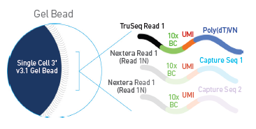

# To use this notebook

1. Go to ood.ccv.brown.edu (you will need an Oscar account).
2. Go to 'Clusters' in the blue menu bar at the top and click the drop-down that says '>_OSCAR Shell Access'
3. Go to your home folder and make a folder called `scrna_r_workshop_2023` (`cd ~` and `mkdir scrna_r_workshop_2023`), then type `pwd` to get the path to this folder.
4. Look under `Interactive Apps` in the blue menu bar and click on `RStudio on Singularity` under `Expert GUIs`.

Fill in the fields as follows:

`Account`: leave blank         
`Partition`: leave blank       
`Number of hours`: 3       
`Num Cores`: 16       
`Memory`: 40       
`Singularity Container Path`: /gpfs/data/shared/databases/workshops/bootcamp_2023/scrna_r_workshop.sif
`Package install Path`: leave blank                    
`Path for R Executable`: This should be the full path to the `scrna_r_workshop_2023` you made in step 3. 
`R Module`: leave blank     
`Additional Data Path`: /gpfs/data/shared/databases/workshops/bootcamp_2023/scrna_r_workshop    

Once your job starts, click the button to connect to session.     
At the top of the screen you'll see a menu bar that starts with 'file', click on 'file' and 'open file'.     
It will ask for a File name -- paste this into the box:      `/gpfs/data/shared/databases/workshops/bootcamp_2023/scrna_r_workshop/intro.Rmd`          

# Introduction to scRNA-seq

**What we will cover**
- How does scRNA-seq differ from bulk RNA-seq?
- scRNAseq technologies
- Parallelization options for Seurat and other packages
- Seurat objects and importing data
- Data merging, QC, and filtering
- SCTransform normalization, clustering, dimension reduction
- Data integration
- Differential expression testing
- Data visualization
- Classifying cell types with a reference atlas with TransferAnchors from Seurat    

Much of this notebook is adapted from the Seurat vignettes https://satijalab.org/seurat and GitHub repository https://github.com/satijalab/seurat


### How does scRNA-seq differ from bulk RNA-seq?


- In bulk RNA-seq you are taking a snapshot of expression of all the cells in a sample and your measurements are aggregated across all of those cells.

- In scRNA-seq, you can get a sense of the heterogeneity of the cells in your sample.
    - Are there novel or rare cell types?
    - What about cell type specific gene expression?
    - Does the distribution of different cell types change across time or treatment?
- This increased resolution comes with some unique challenges.
    - Dropouts - genes that are not detected in some cells, can lead to sparse expression matrices with many zero values.
    - Doublets - sequencing two cells at the same time and can't distinguish their expression or cell types, need to filter these out during QC.
    - Dying cells - you will lose some cells because they are dead or dying, you can also filter these out during sample QC.
    - You also should be cautious when thinking about your sample sizes. For example, you may be sequencing thousands of cells but if they all come from the same mouse you lose the ability to generalize your findings.
   
### scRNAseq technologies
- Although 10X genomics is probably the most popular technology for scRNA-seq, there are other flavors (see PMID 30472192 and PMID 28212749).   


- 10x sequencing encapsulates a cell, reagents, and a bead w/ primer in an oil droplet (aka GEM or Gel Bead-in EMulsion).    
- If you have a situation where one droplet has two cells, this is a 'doublet', you can also have empty droplets where there's no cell encapsulated.




- After encapsulation of cells, beads, and reagents in the oil droplets, the bead is dissolved and releases primers. 
- The poly (dT) primers are used for generating the gene expression libraries. 
- The capture sequence primers are shown in a lighter shading because they are only used in situations where you'd like to add an extra channel of information to your experiment by using feature barcoding (cell-surface protein characterization, multiplexing, etc.).

Let's go over the details of how the library prep works (see https://teichlab.github.io/scg_lib_structs/methods_html/10xChromium3.html)


- The polyA mRNAs are captured using the oligo(dT) on the beads, MMLV (Moloney Murine Leukemia Virus) reverse transcriptase synthesizes complementary strand to the fragment thats captured.


- The RT adds some extra Cs on the end.


The template-switching oligo is added so we can continue across the other strand.


Add primers to amplify full length cDNA


Fragment cDNA, perform A-tailing


At this point we add the Truseq adapters, product 3 is what you'll actually sequence.


- Add the library PCR primers 1 and 2 to amplify the library


- The final library structure looks like the above image -- the exact length of the UMI might depend on which chemistry you're using.


The actual sequencing looks like the above image -- Truseq Read 1 uses bottom strand as template and sequences the bacrode + UMI, Sample Index primer sequences the sample index using bottom strand as template. Regenerate clusters and Truseq Read 2 primer sequences the second read using the top strand as template.


- The above steps assume a single index library, if you're using dual indexes there will be another sample index between the P5 and Truseq Read 1.
- Dual indexed libraries are beneficial to help prevent index hopping (https://www.10xgenomics.com/blog/sequence-with-confidence-understand-index-hopping-and-how-to-resolve-it).

- https://teichlab.github.io/scg_lib_structs/ is an excellent resource for information about the resulting library structures for 10x libraries (and other single cell technologies like Drop-seq or SMART-seq) and was our resource for most of this section.

### Parallelization options for Seurat and other packages

Let's get started. First, we'll need to set the `.libPaths()` since we are using a Singularity container.

```{r "set lib paths"}
.libPaths(c('/usr/local/lib/R/site-library', '/usr/local/lib/R/library'))
```

All of the methods we are discussing here involve computationally heavy methods, and as such also take advantage of parallelization where they can. Often in their documentation you will find how to use multiple cores when calling a function, usually involving a provided argument or involving a package called `future`. For example, Seurat has a [vignette on parallelization](https://satijalab.org/seurat/articles/future_vignette.html) with `future`. We will follow it here:

```{r}
library(future)
# check the current active plan
plan()
```

We set workers=8 because we've requested 8 cores. Additionally, we set `multisession` instead of `multiprocess` despite what the vignette says, because `multiprocess` is actually deprecated in `future` and we should be explicitly specifying `multisession` or `multicore` instead. Getting into the difference is out of scope of this workshop, but you can [read more](https://cran.r-project.org/web/packages/future/vignettes/future-1-overview.html) on future yourself if interested.

```{r}
# change the current plan to access parallelization
plan("multisession", workers = 8)
plan()
```
We'll also set a seed at the start of the notebook so that we can reproduce our results if we decide to re-run this notebook at some future date. We also set `future.globals.maxSize`, see this link for discussion about why we do that (basically we might be exceeding the allowed global variable size so we make that default bigger) https://satijalab.org/seurat/archive/v3.0/future_vignette.html

```{r "setup"}
set.seed(61)
options(future.globals.maxSize = 4000 * 1024^5)
```

- Then we load all the libraries we need:
```{r "setup"}

library(RColorBrewer)
library(Seurat)
library(patchwork)
library(ggplot2)
library(dplyr)
library(hdf5r)
library(stringr)
library(biomaRt)
library(viridis)
library(SeuratDisk)
library(SeuratData)
library(msigdbr)
library('pbmc3k.SeuratData')
library('cbmc.SeuratData')
library('ifnb.SeuratData')
data("pbmc3k")
data("cbmc")
data("ifnb")
```


### Seurat objects and importing data
- This workshop focuses on using Seurat objects to structure your scRNA-seq data (https://github.com/satijalab/seurat/wiki/Seurat).     

{height=600px width=300px} 

- Each Seurat object is composed of different slots.
    - **`assays`** is a list of all the assays in the object.
        - Typically only has the `RNA` assay, but you can add others (like `SCT` shown in the figure above, could also be antibody-derived tags, etc.). 
        - You can see which assay is the currently active assay by looking in the `active.assay` slot and switch between them using the `DefaultAssay()` function.
        - Each assay will store multiple transformations of the data in different slots -- in the case of `RNA` data these slots are: 
            - `@counts` contains the raw counts.
            - `@data` contains the normalized counts.
            - `@scale.data` contains the scaled data for dimensional reduction.
        - The slots store the data as a sparse matrix where the rows are gene and the columns are cells.      
    - **`meta.data`** is a matrix of all the cell-level metadata.
        - This will include information about which condition, timepoint, batch, etc. a for a given cell.
        - It also includes metrics that will be relevant for QC, like `nCount_RNA` and `nFeature_RNA`
            - `nCount_RNA` is the total number of molecules (UMIs) detected within a cell.
            - `nFeature_RNA` is the total number of genes detected within a cell.
        - Once you have completed clustering, you'll also see information about which cluster each cell has been assigned to.
        - The different categories or columns in the `meta.data` are also called `Idents` in Seurat.
        - You can see the current `Ident` in the `active.ident` slot and switch between them using the `Idents()` function (this will probably be important for running differential expression testing).
    - **`graphs`** is a list of the nearest neighbor graphs.
        - The objects stored in `graphs` are cell x cell matrices containing the neighborhood overlap (Jaccard index) between every cell and its nearest neighbors. 
    - **`reductions`** is a list of `DimReduc` objects.
    - **`version`** contains information about which version of Seurat was used to make the object.
    - There are other optional slots, including **`tools`** and **`misc`** that can be populated by specific analysis tools (`tools`) or users can store their own additional information (`misc`).
    
**Much of this notebook is taken from the various Seurat vignettes: https://satijalab.org/seurat/articles/get_started.html**

 - We are using the `SeuratData` package for some test data. 
 - Use `AvailableData()` to see what datasets are available
```{r}
AvailableData()
```

- We've already installed a few of the test data sets in this container, you would usually be able to install more datasets using `InstallData` but won't have permissions to install in this container. 
- If you are using Seurat with your own data, you could use the functions `Read10X` or `Read10X_h5` to import data.
- `Read10X_h5` works with H5 files -- "Hierarchical Data Format (HDF5 or H5). H5 is a binary format that can compress and access data much more efficiently than text formats such as MEX, which is especially useful when dealing with large datasets." https://support.10xgenomics.com/single-cell-gene-expression/software/pipelines/latest/advanced/h5_matrices.   
- You could also use you could also use `Read10X` and give a path to a folder that contains your matrix, features, and barcode tsv files.
- After you have read in the 10X data, use it as the input to the `CreateSeuratObject` function.
- We can look at the Seurat objects we've loaded from SeuratData:

```{r}
ifnb
pbmc3k
```
- The `pbmc3k` dataset is 2,700 peripheral blood mononuclear cells (PBMC) from 10X genomics.
```{r}
?pbmc3k
```
- The `ifnb` dataset is 14,000 IFNB-Stimulated and Control PBMCs.
```{r}
?ifnb
```

What assays and meta.data are available? 
```{r}
pbmc3k@assays
pbmc3k@meta.data

ifnb@assays
ifnb@meta.data
```

### Data merging, QC, and filtering

- Let's merge the datasets to make our QC and filtering a bit smoother (https://satijalab.org/seurat/articles/merge_vignette.html)
- `merge()` merges the raw count matrices of two Seurat objects and creates a new Seurat object with the resulting combined raw count matrix. 
- To easily tell which original object any particular cell came from, you can set the add.cell.ids parameter with an c(x, y) vector, which will prepend the given identifier to the beginning of each cell name. 
- The original project ID will remain stored in object meta data under orig.ident

```{r "merge"}
all_data <- merge(x = ifnb, y = pbmc3k, add.cell.ids = c("ifnb", "pbmc3k"), project = 'pbmc')
unique(all_data@meta.data$orig.ident)
```

- We care about the percentage of reads that map to the mitochondrial genome because high mitochondrial reads in a cell can indicate that the cells are low-quality or dying cells
- The mitochondrial QC metrics are calcualted with the `PercentageFeatureSet()` function, which calculates the percentage of counts originating from a set of features
- We use the set of all genes starting with MT- as a set of mitochondrial genes -- the format of the mt sequences will vary depending on which organism/genome is used...(might be 'mt-' for example).

```{r "add mt percent data"}
all_data[["percent.mt"]] <- PercentageFeatureSet(all_data, pattern = "^MT-")
```

- Before we plot, we can set the order of the object idents to whatever order we'd like:
```{r}
Idents(all_data) <- 'orig.ident'
levels(all_data) <- c("pbmc3k", "IMMUNE_CTRL", "IMMUNE_STIM")

```

- We can also look at plots showing the distribution of the `percent.mt`, `nFeature_RNA` and `nCount_RNA`
- `nFeature_RNA` is the number of genes 
- `nCount_RNA` is the number of UMIs (unique molecules -- like counts)

```{r  "QC plots"}
VlnPlot(all_data, features = "nFeature_RNA")
VlnPlot(all_data, features = "nCount_RNA")
VlnPlot(all_data, features="percent.mt")

FeatureScatter(all_data, feature1 = "nCount_RNA", feature2 = "nFeature_RNA")
FeatureScatter(all_data, feature1 = "nCount_RNA", feature2 = "percent.mt")
FeatureScatter(all_data, feature1 = "nFeature_RNA", feature2 = "percent.mt")

```
- Low quality cells or empty droplets might have very few genes (nFeatures)
- Dead or dying cells will also have high mitochondrial contamination
- Doublets or multiplets will have high gene counts (nFeatures)
- The total number of molecules (nCount) detected in a cell corresponds with the number of genes (nFeatures)

- Most of the cells have less than 2000 genes and less than 7000 or so UMIs.
- Very low mitochondrial counts from the ifnb data -- perhaps this dataset was pre-filtered before being packaged into SeuratData.
- We can see groups of cells with high mitochondrial counts, low UMI counts, and lower numbers of genes.
- Our goal in QC filtering is to retain as much useful information as we can, while removing doublets, empty droplets, and dead cells.
- We will pick some thresholds for filtering based off of what we see in our data, keeping in mind that if you are doing this with your own data, your plots will probably look very different.
- Let's filter our data using `subset`, we'll keep cells that have between 500 and 7000 nFeature_RNA (genes) and less than 10% mitochondrial reads.

```{r "Data filtering"}
all_data_sub <- subset(all_data, subset = nFeature_RNA > 500 & nFeature_RNA < 7000 & percent.mt < 10)
```

- You can re-examine your QC plots after filtering if you'd like:
```{r}
VlnPlot(all_data_sub, features = "nFeature_RNA")
VlnPlot(all_data_sub, features = "nCount_RNA")
VlnPlot(all_data_sub, features="percent.mt")

FeatureScatter(all_data_sub, feature1 = "nCount_RNA", feature2 = "percent.mt")
FeatureScatter(all_data_sub, feature1 = "nFeature_RNA", feature2 = "percent.mt")
FeatureScatter(all_data_sub, feature1 = "nCount_RNA", feature2 = "nFeature_RNA")
```

- Next, we'll use `SCTransform` to normalize -- use as an alternative to the `NormalizeData`, `FindVariableFeatures`, `ScaleData` workflow, which is the default of what Seurat usually suggests.
- First, split the merged object by `orig.ident`.

```{r "Split data by orig.ident"}
all_data_split <- SplitObject(all_data_sub, split.by = 'orig.ident')
```


### SCTransform normalization, clustering, dimension reduction

Theory
scRNAseq data is normalized so that we can mitigate technical effects while preserving the biological signal in the data -- we should be able to find the biological signal in cells irrespective of how deeply we sequenced the cell. The theory behind SCTransform (https://genomebiology.biomedcentral.com/articles/10.1186/s13059-019-1874-1) is very similar to the generalized linear models (GLMs) used in bulkRNAseq analysis packages like DESeq2 and edgeR. In DESeq2 a negative binomial model is fitted to the counts and the mean and dispersion (roughly speaking how variable the observed count will be from the mean count) estimates from that model are used as the test statistics for comparison between groups. The same idea applies with SCTransform, with an additional aspect where SCTransform pools information across genes with similar abundances in order to address the higher sparsity of single cell data. 

Below is a side-by-side comparison of sctransform with NormalizeData, FindVariableFeatures and ScaleData on the PBMC3k data:

We also like this figure from the SCTransform paper, which shows how SCTransform ('Pearson Residuals') and the standard log-transformation approach ('Log-normalization') helps alleviate variance in your data from sequencing depth alone :


- We can run SCTransform on the data list you just made.
- You might get see a warning that says 'iteration limit reached' when you run this.
- This warning can be ignored (https://github.com/satijalab/sctransform/issues/25) because the parameter estimation generating this warning is regularized later anyway. 
- You can use the `vars.to.regress` argument to regress out nuisance variables (like cell cycle or batch effects)
- When you run SCTransform you need to specify an additional parameter otherwise only the variable genes will be included in the scale data slot. Add `return.only.var.genes = FALSE` to the function call and that should solve the issue (https://github.com/satijalab/seurat/issues/3553).

```{r "SCTransform"}
#all_data_list <- lapply(all_data_split, function(x) {
#    x <- SCTransform(x,verbose=FALSE,return.only.var.genes = FALSE)}) 
#saveRDS(all_data_list, file="/gpfs/data/shared/databases/workshops/bootcamp_2023/scrna_r_workshop/data/all_data_list.Rds")

all_data_list <- readRDS("/gpfs/data/shared/databases/workshops/bootcamp_2023/scrna_r_workshop/data/all_data_list.Rds")


```

- Then we can re-merge the data using `merge.data = TRUE` so that we also merge the data slots instead of just merging the counts (which requires re-normalization). This is recommended if the same normalization approach was applied to all objects.
```{r}
#all_data_merged <- merge(x = all_data_list$pbmc3k, y = c(all_data_list$IMMUNE_CTRL, all_data_list$IMMUNE_STIM), merge.data = TRUE)
#saveRDS(all_data_merged, file="/gpfs/data/shared/databases/workshops/bootcamp_2023/scrna_r_workshop/data/all_data_merged.Rds")

all_data_merged  <- readRDS("/gpfs/data/shared/databases/workshops/bootcamp_2023/scrna_r_workshop/data/all_data_merged.Rds")

```

- Then run PCA
```{r}
#all_data_merged <- RunPCA(all_data_merged)
```

- You are getting an error because after the merge, the variable feature slot gets wiped since there could be different variable features in each original object. 
- The default for `RunPCA` is to use those features and since it's empty, you get an error. 
- You can either set the variable features of the merged SCT assay yourself (to something like the intersection or union of the individual object's variable features) or provide this vector of features to RunPCA itself (https://github.com/satijalab/seurat/issues/2852).
- We will run `SelectIntegrationFeatures` on the list of Seurat objects before merge and then assign those as the `VariableFeatures`

```{r}
integration_features <- SelectIntegrationFeatures(all_data_list)
VariableFeatures(all_data_merged) <- integration_features
```

Then we can run the PCA and make an elbow plot:
```{r}
all_data_merged <- RunPCA(all_data_merged)
ElbowPlot(all_data_merged)
```

- Based on this plot, we get diminishing information returned once we get above ~10 PCs.
- Next, `FindNeighbors`, which will construct a KNN graph based on the euclidean distance in PCA space, and refine the edge weights between any two cells based on the shared overlap in their local neighborhoods (Jaccard similarity). 
- The input is the previously defined dimensionality of the dataset (first 10 PCs).

```{r}
#all_data_merged <- FindNeighbors(all_data_merged, dims = 1:10)
#saveRDS(all_data_merged, file="/gpfs/data/shared/databases/workshops/bootcamp_2023/scrna_r_workshop/data/all_data_merged_FindNeighbors.Rds")
all_data_merged <- readRDS("/gpfs/data/shared/databases/workshops/bootcamp_2023/scrna_r_workshop/data/all_data_merged_FindNeighbors.Rds")

```

- To cluster the cells, we run `FindClusters` to apply the Louvain algorithm to iteratively group cells together, with the goal of optimizing the standard modularity function. 
- `FindClusters` takes a `resolution` argument (defaults to a value of 0.8), which sets the granularity of the clustering, setting this parameter between 0.4-1.2 typically returns good results for single-cell datasets of around 3K cells but the resolution might increase for larger datasets.
- Let's run `FindClusters` with the default parameters:
```{r}
#all_data_merged <- FindClusters(all_data_merged)
#saveRDS(all_data_merged, file="/gpfs/data/shared/databases/workshops/bootcamp_2023/scrna_r_workshop/data/all_data_merged_FindClusters.Rds")
all_data_merged <- readRDS("/gpfs/data/shared/databases/workshops/bootcamp_2023/scrna_r_workshop/data/all_data_merged_FindClusters.Rds")

```

- Seurat offers several non-linear dimensional reduction technique to visualize and explore these datasets (umap, tsne). 
- The goal of these algorithms is to learn the underlying manifold of the data in order to place similar cells together in low-dimensional space. 
- As input to the UMAP and tSNE, we suggest using the same PCs as input to the clustering analysis. 
- We recommend using FIt-SNE to make things faster. It is based on Kluger Lab code found here: https://github.com/KlugerLab/FIt-SNE 

```{r}
all_data_merged <- RunUMAP(all_data_merged, dims = 1:10)
all_data_merged <- RunTSNE(all_data_merged, tsne.method = "FIt-SNE", seed.use=61)
```

- Look at the clusters using `DimPlot()` function
```{r}
DimPlot(all_data_merged, reduction='tsne')
DimPlot(all_data_merged, reduction='umap')
```

- Group the plots by the `idents`
```{r}
DimPlot(all_data_merged, reduction='tsne', group.by = 'orig.ident')
DimPlot(all_data_merged, reduction='umap', group.by = 'orig.ident')
```

### Data Integration

In most cases if we are looking for differences in gene expression between experimental conditions, we will actually want to integrate our datasets rather than merge them. This is because the experimental conditions can cause cells to cluster both by condition and by cell type. See https://satijalab.org/seurat/articles/integration_introduction.html#introduction-to-scrna-seq-integration-1 for more details. 

Here, we will show how to integrate SCTransform-normalized data.

The first step is `SelectIntegrationFeatures()`, which ranks features by the number of datasets they are deemed variable in, breaking ties by the median variable feature rank across datasets, and returns the top scoring features by this ranking.

```{r}
#integration_features <- SelectIntegrationFeatures(all_data_list)
#saveRDS(integration_features, file="/gpfs/data/shared/databases/workshops/bootcamp_2023/scrna_r_workshop/data/all_data_merged_integration_features.Rds")
integration_features <- ("/gpfs/data/shared/databases/workshops/bootcamp_2023/scrna_r_workshop/data/all_data_merged_integration_features.Rds")

```

Next, we `PrepSCTIntegration`, which takes a list of objects that have been normalized with SCTransform and performs the following steps:
- If `anchor.features` is a numeric value, calls `SelectIntegrationFeatures` to determine the features to use in the downstream integration procedure.
- Ensures that the `SCTransform` residuals for the features specified to `anchor.features` are present in each object in the list. This is necessary because the default behavior of `SCTransform `is to only store the residuals for the features determined to be variable. Residuals are recomputed for missing features using the stored model parameters via the `GetResidual` function.
- Subsets the `scale.data` slot to only contain the residuals for `anchor.features` for efficiency in downstream processing.

```{r}
#all_data_list <- PrepSCTIntegration(object.list = all_data_list, anchor.features = integration_features)
#saveRDS(all_data_list, file="/gpfs/data/shared/databases/workshops/bootcamp_2023/scrna_r_workshop/data/all_data_merged_PrepSCTIntegration.Rds")
all_data_list <- readRDS("/gpfs/data/shared/databases/workshops/bootcamp_2023/scrna_r_workshop/data/all_data_merged_PrepSCTIntegration.Rds")

```

Find a set of anchors between a list of Seurat objects, they can later be used to integrate the objects using the `IntegrateData` function.
```{r}
#anchors <- FindIntegrationAnchors(object.list = all_data_list, normalization.method = "SCT", anchor.features = integration_features)
#saveRDS(anchors, file="/gpfs/data/shared/databases/workshops/bootcamp_2023/scrna_r_workshop/data/all_data_merged_anchors.Rds")

anchors <- readRDS("/gpfs/data/shared/databases/workshops/bootcamp_2023/scrna_r_workshop/data/all_data_merged_anchors.Rds")


```

The last step is integrating the data:
```{r}
#all_data_integrated <- IntegrateData(anchorset = anchors, normalization.method = "SCT")
#saveRDS(all_data_integrated, file="/gpfs/data/shared/databases/workshops/bootcamp_2023/scrna_r_workshop/data/all_data_integrateds.Rds")
all_data_integrated <- readRDS("/gpfs/data/shared/databases/workshops/bootcamp_2023/scrna_r_workshop/data/all_data_integrateds.Rds")

```

Then we can run PCA on the integrated object:
```{r}
all_data_integrated <- RunPCA(all_data_integrated)
ElbowPlot(all_data_integrated)
```

Then we can also fun UMAP and TSNE:
```{r}
all_data_integrated <- RunUMAP(all_data_integrated, dims = 1:10)
all_data_integrated <- RunTSNE(all_data_integrated, tsne.method = "FIt-SNE", seed.use=61)
```
Find neighbors and clusters
```{r}
#all_data_integrated <- FindNeighbors(all_data_integrated, dims = 1:10)
#saveRDS(all_data_integrated, file="/gpfs/data/shared/databases/workshops/bootcamp_2023/scrna_r_workshop/data/all_data_integrateds_FindNeighbors.Rds")

#all_data_integrated <- FindClusters(all_data_integrated)
#saveRDS(all_data_integrated, file="/gpfs/data/shared/databases/workshops/bootcamp_2023/scrna_r_workshop/data/all_data_integrateds_FindClusters.Rds")

all_data_integrated <- readRDS("/gpfs/data/shared/databases/workshops/bootcamp_2023/scrna_r_workshop/data/all_data_integrateds_FindClusters.Rds")
```

```{r}
DimPlot(all_data_integrated, reduction='tsne', group.by = 'orig.ident')
DimPlot(all_data_integrated, reduction='umap', group.by = 'orig.ident')
```

Then we can compare the tsne and umap plots of the merged and integrated datasets. This helps illustrate why we integrate.

```{r}
DimPlot(all_data_merged, reduction='tsne', group.by = 'orig.ident') + ggtitle("Merged") | DimPlot(all_data_integrated, reduction='tsne', group.by = 'orig.ident') + ggtitle("Integrated")
DimPlot(all_data_merged, reduction='umap', group.by = 'orig.ident') + ggtitle("Merged") | DimPlot(all_data_integrated, reduction='umap', group.by = 'orig.ident') + ggtitle("Integrated")
```

### Differential Expression Testing

Seurat implements differential expression testing using `FindMarkers` and `FindAllMarkers` functions.

- `FindMarkers` finds differentially expressed genes across two identity classes that you specify when calling the function.
- `FindAllMarkers` finds differentially expressed genes for each identity class compared to a combination of all other identity classes.

By default, these functions implement the Wilcoxon rank sum test, but they also take an argument `test.use` that allows you to use alternative tests if you want to do that (run `?FindMarkers` for more information). If you want to use MAST or DESeq2 you'd have to make sure those packages are installed.

Let's try running some of these tests. First, lets see what identity class our current Seurat object is using.

```{r}
levels(Idents(all_data_integrated))
```

Lets make sure we are using the orig.ident as our `Idents`:
```{r}
Idents(all_data_integrated) <- 'orig.ident'
```

And make sure we are using the `RNA` assay:

```{r}
DefaultAssay(all_data_integrated) <- 'RNA'
```

Lets run `FindMarkers` comparing IMMUNE_CTRL and IMMUNE_STIM and use some pre-filtering to look at features that have at least a two-fold change in average expression in each comparison and features that are detected in at least 95% of cells in either group.

```{r}
ctl_vs_stim <- FindMarkers(all_data_integrated, ident.1 = 'IMMUNE_CTRL', ident.2 = 'IMMUNE_STIM', min.pct = 0.95, logfc.threshold = log(2))
ctl_vs_stim
```

The results dataframe has the following columns :

    p_val : p_val (unadjusted)
    avg_log2FC : log fold-change of the average expression between the two groups. Positive values indicate that the feature is more highly expressed in the first group.
    pct.1 : The percentage of cells where the feature is detected in the first group
    pct.2 : The percentage of cells where the feature is detected in the second group
    p_val_adj : Adjusted p-value, based on Bonferroni correction using all features in the dataset.

### Data Visualization

- Seurat comes with many functions for visualizing your data. Conveniently, you can use `ggplot`-like syntax to tweak your figures as needed. 
- First, lets switch to the `SCT` assay for our visualization.

```{r}
DefaultAssay(all_data_integrated) <- 'SCT'
```

- We can make a `FeaturePlot`, which uses the `data` slot by default.
- SCT assay slots are counts, data, and scale.data, which are the corrected counts, log1p(counts), and pearson residuals.

```{r}
FeaturePlot(all_data_integrated, 
            features = rownames(ctl_vs_stim)[1:2], 
            reduction = 'umap',  
            order = T, 
            split.by = 'orig.ident')
```

We can use `ggplot` syntax to add legends:
```{r}
FeaturePlot(all_data_integrated, 
            features = rownames(ctl_vs_stim)[1:2], 
            reduction = 'umap',  
            order = T, 
            split.by = 'orig.ident') +
   theme(legend.position = "right")
```

Note that we are only getting the legend on the last plot that we get when we use the `split.by` argument. This is probably not what we want. If we use the `&` symbol instead of `+`, we can get the legend to populate to all the figures:
```{r}
FeaturePlot(all_data_integrated, 
            features = rownames(ctl_vs_stim)[1:2], 
            reduction = 'umap',  
            order = T, 
            split.by = 'orig.ident') &
   theme(legend.position = "right")
```
We can also use customized colors:

```{r}

FeaturePlot(all_data_integrated, 
            features = rownames(ctl_vs_stim)[1:2], 
            reduction = 'umap',  
            order = T, 
            split.by = 'orig.ident') &
    theme(legend.position = "right") &
    scale_colour_gradientn(colours = rev(brewer.pal(n = 11, name = "Spectral"))) 
```

We have used `VlnPlot` to look at our QC metrics earlier. We can also use it to look expression across clusters, it uses the `counts` slot by default. First, switch to using the clusters as idents:

```{r}
Idents(all_data_integrated) <- 'seurat_clusters'
```

```{r}
VlnPlot(all_data_integrated,features = rownames(ctl_vs_stim)[1])
```

If you split.by orig.ident you'll get plots that are colored a little differently (but start to look a bit crowded):
```{r}
VlnPlot(all_data_integrated, split.by = 'orig.ident', features = rownames(ctl_vs_stim)[1])
```

Another helpful visualization from Seurat is `DotPlot`. The size of each dot indicates the percentage of cells expressing the feature and the color is the average expression level. It uses the scale.data slot by default.

```{r}
DotPlot(all_data_integrated, features = rownames(ctl_vs_stim)[1:5]) & 
    RotatedAxis() 
```

We can use more custom colors:

```{r}
DotPlot(all_data_integrated, features = rownames(ctl_vs_stim)[1:5]) &
    RotatedAxis() & 
    scale_color_viridis(option = "magma", direction = -1) 
```

Seurat also makes heatmaps with `DoHeatmap`, which also uses the "scale.data" slot.

```{r}
Idents(all_data_integrated) <-  'orig.ident'
DefaultAssay(all_data_integrated) <-  'SCT'
DoHeatmap(all_data_integrated, features = rownames(ctl_vs_stim)[1:5])
```

We can use custom colors again if we'd like:
```{r}
DoHeatmap(all_data_integrated, features = rownames(ctl_vs_stim)[1:5]) & 
   scale_fill_gradient2( low = c('#2c7bb6', '#abd9e9'), mid = '#ffffbf', high = c('#fdae61', '#d7191c')) 

```

### Classifying cell types with a reference atlas with TransferAnchors from Seurat 

Seurat has a few built in methods to identify shared cell states present across different datasets. They can be different conditions, different individuals, technologies, etc. First, Seurat tries to find anchors between pairs of datasets. These represent pairwise correspondences between individual cells (one in each dataset), that Seurat hypothesizes originate from the same biological state. These ‘anchors’ are then used to harmonize the datasets, or transfer information from one dataset to another. In the first part of this workshop, we went over running data integration with SCTransform-normalized datasets from different experiments. In this follow up session, we will go over how you can leverage an integrated reference dataset to annotate new query datasets. This can be helpful for using cell atlases to annotate cell types in your experimental datasets.

We'll work with the `panc8` data.

```{r}
panc8
?panc8
```
First, lets split the object and run SCTransform

```{r}
pancreas.list <- SplitObject(panc8, split.by = "tech")
```

Then we run SCTransform
```{r}
#pancreas.list <- lapply(pancreas.list, function(x) {
#    x <- SCTransform(x,verbose=FALSE,return.only.var.genes = FALSE)}) 
#saveRDS(pancreas.list, file="/gpfs/data/shared/databases/workshops/bootcamp_2023/scrna_r_workshop/data/pancreas.list.Rds")
pancreas.list <- readRDS("/gpfs/data/shared/databases/workshops/bootcamp_2023/scrna_r_workshop/data/pancreas.list.Rds")

```

To construct a reference, we will identify ‘anchors’ between the individual datasets. We'll pick three of the objects to construct our integrated reference and save one for using as a query later.  
```{r}
#pancreas.ref <- c(pancreas.list$celseq, pancreas.list$celseq2, pancreas.list$smartseq2)
#pancreas.query <- pancreas.list$fluidigmc1
#saveRDS(pancreas.ref, file="/gpfs/data/shared/databases/workshops/bootcamp_2023/scrna_r_workshop/data/pancreas.ref.Rds")
#saveRDS(pancreas.query, file="/gpfs/data/shared/databases/workshops/bootcamp_2023/scrna_r_workshop/data/pancreas.query.Rds")

pancreas.ref <- readRDS("/gpfs/data/shared/databases/workshops/bootcamp_2023/scrna_r_workshop/data/pancreas.ref.Rds")
pancreas.query <- readRDS("/gpfs/data/shared/databases/workshops/bootcamp_2023/scrna_r_workshop/data/pancreas.query.Rds")

```

Then we can `SelectIntegrationFeatures`, `PrepSCTIntegration`, `FindIntegrationAnchors`, and `IntegrateData`, Run PCA and UMAP
```{r}
# integration_features <- SelectIntegrationFeatures(pancreas.ref)
# saveRDS(integration_features, file="/gpfs/data/shared/databases/workshops/bootcamp_2023/scrna_r_workshop/data/pancreas.integration_features.Rds")
# 
# pancreas.ref <- PrepSCTIntegration(object.list = pancreas.ref, anchor.features = integration_features)
# saveRDS(pancreas.ref, file="/gpfs/data/shared/databases/workshops/bootcamp_2023/scrna_r_workshop/data/pancreas.ref_PrepSCTIntegration.Rds")
# 
# ref.anchors <- FindIntegrationAnchors(object.list = pancreas.ref , normalization.method = "SCT", anchor.features = integration_features)
# saveRDS(ref.anchors, file="/gpfs/data/shared/databases/workshops/bootcamp_2023/scrna_r_workshop/data/pancreas.ref.anchors.Rds")
# 
# pancreas.ref <- IntegrateData(anchorset = ref.anchors, normalization.method = "SCT")
# saveRDS(pancreas.ref, file="/gpfs/data/shared/databases/workshops/bootcamp_2023/scrna_r_workshop/data/pancreas.ref.IntegrateData.Rds")

pancreas.ref <- readRDS("/gpfs/data/shared/databases/workshops/bootcamp_2023/scrna_r_workshop/data/pancreas.ref.IntegrateData.Rds")

pancreas.ref <- RunPCA(pancreas.ref, verbose = FALSE)
pancreas.ref <- RunUMAP(pancreas.ref, reduction = "pca", dims = 1:20, verbose = FALSE)

p1 <- DimPlot(pancreas.ref, reduction = "umap", split.by = "tech") & coord_fixed(ratio = 1)
p2 <- DimPlot(pancreas.ref, reduction = "umap", group.by = "celltype", label = TRUE, repel = TRUE) +
    NoLegend() & coord_fixed(ratio = 1)
p1 / p2
```

Seurat supports the projection of reference data onto a query object. While many of the methods are conserved (both procedures begin by identifying anchors), there are two important distinctions between data transfer and integration:

    In data transfer, Seurat does not correct or modify the query expression data.
    In data transfer, Seurat has an option (set by default) to project the PCA structure of a reference onto the query, instead of learning a joint structure with CCA. We generally suggest using this option when projecting data between scRNA-seq datasets.

After finding anchors, we use the `TransferData()` function to classify the query cells based on reference data (a vector of reference cell type labels). `TransferData()` returns a matrix with predicted IDs and prediction scores, which we can add to the query metadata.

First, FindTransferAnchors between pancreas.ref and pancreas.query.
```{r}
#pancreas.anchors <- FindTransferAnchors(reference = pancreas.ref, 
#                                        query = pancreas.query,
#                                        dims = 1:20, 
#                                        reference.reduction = "pca")
#saveRDS(pancreas.anchors, file="/gpfs/data/shared/databases/workshops/bootcamp_2023/scrna_r_workshop/data/pancreas.anchors.Rds")
pancreas.anchors <- readRDS("/gpfs/data/shared/databases/workshops/bootcamp_2023/scrna_r_workshop/data/pancreas.anchors.Rds")

```

Classify query cells based on reference data
```{r}
#predictions <- TransferData(anchorset = pancreas.anchors, 
#                            refdata = pancreas.ref$celltype,
#                            dims = 1:20)
#saveRDS(predictions, file="/gpfs/data/shared/databases/workshops/bootcamp_2023/scrna_r_workshop/data/pancreas.predictions.Rds")
predictions <- readRDS("/gpfs/data/shared/databases/workshops/bootcamp_2023/scrna_r_workshop/data/pancreas.predictions.Rds")

```

Add the cell predictions to the pancreas.query metadata
```{r}
#pancreas.query <- AddMetaData(pancreas.query, metadata = predictions)
#saveRDS(pancreas.query, file="/gpfs/data/shared/databases/workshops/bootcamp_2023/scrna_r_workshop/data/pancreas.query_metadata.Rds")
pancreas.query <- readRDS("/gpfs/data/shared/databases/workshops/bootcamp_2023/scrna_r_workshop/data/pancreas.query_metadata.Rds")

```

Because we have the original label annotations from our full integrated analysis, we can evaluate how well our predicted cell type annotations match the full reference. In this example, we find that there is a high agreement in cell type classification, with over 96% of cells being labeled correctly.
```{r}
pancreas.query$prediction.match <- pancreas.query$predicted.id == pancreas.query$celltype
table(pancreas.query$prediction.match)
```


**Thank you!**
    
- Much of this notebook was adapted from the Seurat vignettes https://satijalab.org/seurat and GitHub repository https://github.com/satijalab/seurat
- If you have questions you can come by our office hours! We host them on Tuesdays from 10-11 and Wednesdays from 3-4 -- for more details see https://events.brown.edu/ccv/all


